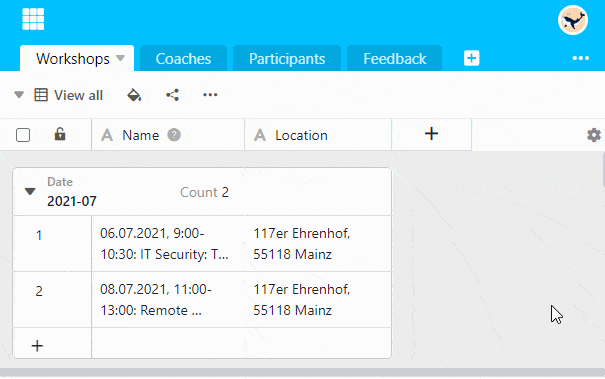

Duplicar a **altura do cabeçalho da tabela para** poder ler completamente os nomes longos das colunas.

1. Clique no **símbolo da roda dentada**  na extrema direita do cabeçalho da mesa.
2. Seleccionar a opção **Definir Altura do Cabeçalho da Mesa**.
3. Clique na opção **Duplo**.


