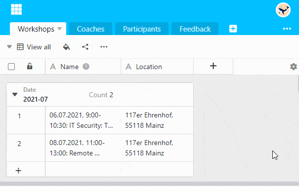

Удвойте **высоту заголовка таблицы**, чтобы иметь возможность полностью прочитать длинные имена столбцов.

1. Нажмите на **символ шестеренки**  в крайнем правом углу заголовка таблицы.
2. Выберите опцию **Установить высоту заголовка таблицы**.
3. Нажмите на опцию **Double**.


