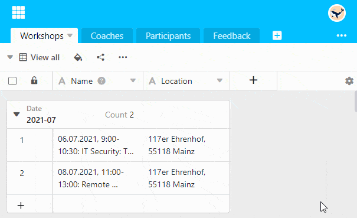

You can **hide** the **column arrows** with which you open the **drop-down menu of the column options**. This makes sense, for example, if you no longer want to change the **finished configuration of** the columns and want to have a clearer view.

1. Click the **gear icon**  on the far right of the table header.
2. Select the **Hide drop-down arrow** option.


