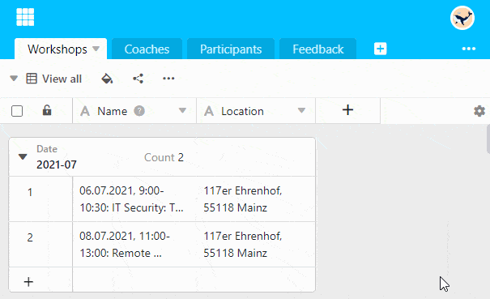

Puede **ocultar** las **flechas de columna** con las que se abre el **menú desplegable de las opciones de columna**. Esto tiene sentido, por ejemplo, si ya no desea cambiar la **configuración acabada de** las columnas y quiere tener una visión más clara.

1. Haga clic en el **símbolo de la rueda dentada**  situado en el extremo derecho de la cabecera de la tabla.
2. Seleccione la opción **Ocultar flecha desplegable**.


