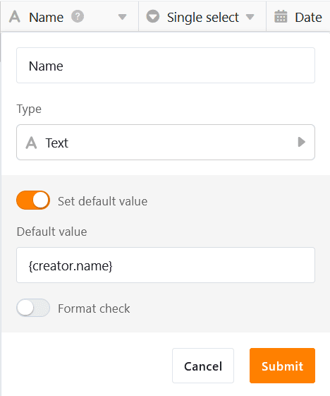

Wenn Sie einen **Standardwert** für eine Spalte festlegen, wird dieser **automatisch in jede neue Zeile** der Tabelle eingetragen. Mit vordefinierten Standardwerten können Sie sich also einige Klicks beim [Hinzufügen neuer Zeilen](https://seatable.io/docs/arbeiten-mit-zeilen/hinzufuegen-einer-zeile/) ersparen. Die automatisch eingetragenen Werte können Sie anschließend natürlich noch manuell anpassen.

## Wie Sie Standardwerte festlegen

1. Klicken Sie auf das dreieckige **Drop-down-Symbol**  rechts neben dem Namen der Spalte, für die Sie einen Standardwert definieren möchten.
2. Wählen Sie die Option **Standardwert festlegen**.
3. Geben Sie den gewünschten **Standardwert** ein. Je nach Spaltentyp haben Sie verschiedene Möglichkeiten zur Auswahl.
4. Bestätigen Sie den Vorgang mit der **Enter-Taste** oder einem **Klick** außerhalb des Dialogfensters.
5. Wenn Sie nun eine **neue Zeile anlegen**, trägt SeaTable automatisch die entsprechenden Werte ein. Anschließend können Sie die Daten wie gewohnt **anpassen**.



Zudem können Sie bereits beim [Anlegen einer neuen Spalte](https://seatable.io/docs/arbeiten-mit-spalten/hinzufuegen-einer-spalte/) direkt einen Standardwert festlegen.

## Für welche Spaltentypen Sie Standardwerte festlegen können

Standardwerte können für zahlreiche, aber nicht für alle [Spaltentypen in SeaTable](
) definiert werden. Spalten, deren Inhalt automatisch von SeaTable generiert wird ([Formeln](https://seatable.io/docs/formeln/grundlagen-von-seatable-formeln/), [Automatische Nummer](https://seatable.io/docs/text-und-zahlen/der-spaltentyp-automatische-nummer/), [Ersteller und Erstelldatum](https://seatable.io/docs/datum-dauer-und-personen/die-spalten-ersteller-und-erstelldatum/), [Letzter Bearbeiter und Bearbeitungsdatum](https://seatable.io/docs/datum-dauer-und-personen/die-spalten-letzter-bearbeiter-und-bearbeitungsdatum/)), bieten diese Option genauso wenig wie bei [Schaltflächen](https://seatable.io/docs/andere-spalten/die-schaltflaeche/), [Bild-](https://seatable.io/docs/dateien-und-bilder/die-bild-spalte/), [Datei-](https://seatable.io/docs/dateien-und-bilder/die-datei-spalte/) und [Signatur-](https://seatable.io/docs/dateien-und-bilder/die-signatur-spalte/)Spalten.

**Hier eine Übersicht, für welche Spaltentypen Sie Standardwerte festlegen können:**

| Spaltentyp             | unterstützt Standardwerte                                     |
| ---------------------- | ------------------------------------------------------------- |
| Automatische Nummer    |                                    |
| Bild                   |                                    |
| Checkbox               |  |
| Datei                  |                                    |
| Datum                  |  |
| Dauer                  |                                    |
| Einfachauswahl         |  |
| E-Mail                 |                                    |
| Ersteller              |                                    |
| Erstellt               |                                    |
| Formatierter Text      |  |
| Formel                 |                                    |
| Formel für Verknüpfung |                                    |
| Geoposition            |                                    |
| Letzter Bearbeiter     |                                    |
| Mehrfachauswahl        |                                    |
| Mitarbeiter            |  |
| Rating                 |  |
| Schaltfläche           |                                    |
| Signatur               |                                    |
| Text                   |  |
| URL                    |                                    |
| Zahl                   |  |
| Zuletzt bearbeitet     |                                    |

## Referenzierte Standardwerte in Text-Spalten

Wenn Sie als Standardwert in einer [Text-Spalte](https://seatable.io/docs/text-und-zahlen/die-spalten-text-und-formatierter-text/) die Referenz **{creator.name}** oder **{creator.id}** festlegen, wird automatisch der **Name** oder die **ID des Benutzers** eingetragen, der die Zeile hinzugefügt hat.

## Der Wirkungsbereich von Standardwerten

Die Standardwerte greifen **überall**, wo Sie neue Zeilen anlegen können:

- in einer [Tabelle](https://seatable.io/docs/arbeiten-mit-zeilen/hinzufuegen-einer-zeile/)
- in einer [Link-Spalte](https://seatable.io/docs/verknuepfungen/wie-man-tabellen-in-seatable-miteinander-verknuepft/)
- per [Schaltfläche](https://seatable.io/docs/andere-spalten/zeilen-per-schaltflaeche-in-eine-andere-tabelle-kopieren/) (Aktion: „Zeile in andere Tabelle kopieren“)
- per [Automation](https://seatable.io/docs/automationen/automations-aktionen/) (Aktionen: „Zeile hinzufügen“ und „Neuen Eintrag in anderer Tabelle hinzufügen“)
- im [Kalender-](https://seatable.io/docs/plugins/neue-kalendereintraege-im-kalender-plugin-anlegen/), [Galerie-](https://seatable.io/docs/plugins/eine-neue-zeile-ueber-das-galerie-plugin-hinzufuegen/) oder [Kanban-Plugin](https://seatable.io/docs/plugins/anleitung-zum-kanban-plugin/)
- über [Webformulare](https://seatable.io/docs/webformulare/webformulare/)
- auf [Tabellen-](https://seatable.io/docs/seitentypen-in-universellen-apps/tabellenseiten-in-universellen-apps/), [Formular-](https://seatable.io/docs/seitentypen-in-universellen-apps/formularseiten-in-universellen-apps/) und [Kanbanseiten](https://seatable.io/docs/seitentypen-in-universellen-apps/kanbanseiten-in-universellen-apps/) von Apps

## Standardwerte in Webformularen

Zusätzlich zu den in der Tabelle definierten Standardwerten haben Sie bei [Webformularen](https://seatable.io/docs/webformulare/webformulare/) die Möglichkeit, Standardwerte für die mit den Spalten verknüpften Formularfelder zu setzen. Dabei können Sie auch einstellen, ob die Benutzer beim Ausfüllen des Formulars diese **Standardwerte ändern** dürfen.



## Standardwerte in Apps

Die in der Base definierten Standardwerte wirken sich auch auf Zeilen aus, die auf **Tabellen-, Formular- und Kanban-Seiten** von [Universellen Apps](https://seatable.io/docs/apps/universelle-app/) erfasst werden. Der einzige [Seitentyp](https://seatable.io/docs/apps/seitentypen-in-der-universellen-app/), für den Sie in der App trotzdem Standardwerte setzen können, ist die [Formularseite](https://seatable.io/docs/seitentypen-in-universellen-apps/formularseiten-in-universellen-apps/). Die Einstellungen funktionieren genauso wie bei Webformularen: Aktivieren Sie dazu die Regler, wie auf dem obigen Screenshot zu sehen ist.
