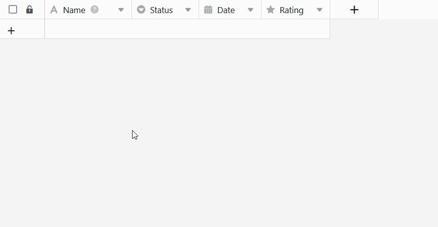
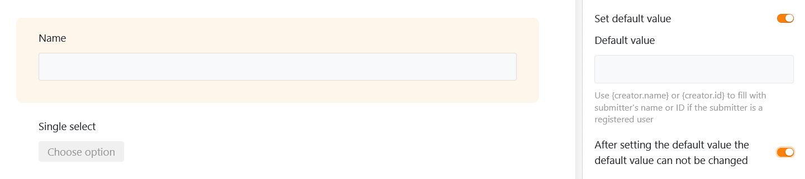

Si define un **valor** por defecto para una columna, éste se **introduce automáticamente en cada nueva** fila de la tabla. Con los valores por defecto predefinidos, puede ahorrarse unos cuantos clics al [añadir nuevas filas](). Por supuesto, después puede ajustar manualmente los valores introducidos automáticamente.

## Cómo establecer valores por defecto

1. Haga clic en el **icono** triangular **desplegable**  situado a la derecha del nombre de la columna para la que desea definir un valor por defecto.
2. Seleccione la opción **Establecer valor por defecto**.
3. Introduzca el **valor por defecto** deseado. Dependiendo del tipo de columna, tiene varias opciones para elegir.
4. Confirme el proceso con el **botón Intro** o **haciendo clic** fuera de la ventana de diálogo.
5. Si ahora **crea** una **nueva fila**, SeaTable introduce automáticamente los valores correspondientes. A continuación, puede **ajustar** los datos como de costumbre.



También puede definir un valor por defecto directamente al [crear una nueva columna]().

## Para qué tipos de columnas puede definir valores por defecto

Se pueden definir valores por defecto para muchos, pero no todos, [los tipos de columnas en]() SeaTable. Las columnas cuyo contenido es generado automáticamente por SeaTable[(fórmulas](), [archivo](https://seatable.io/es/docs/dateien-und-bilder/die-datei-spalte/) y [firma](https://seatable.io/es/docs/dateien-und-bilder/die-signatur-spalte/).

**A continuación encontrará un resumen de los tipos de columna para los que puede definir valores por defecto:**

| Tipo de columna          | Admite valores por defecto                                    |
| ------------------------ | ------------------------------------------------------------- |
| Número automático        |                                    |
| Imagen                   |                                    |
| Casilla de verificación  |  |
| Archivo                  |                                    |
| Fecha                    |  |
| Duración                 |                                    |
| Selección individual     |  |
| Correo electrónico       |                                    |
| Creador                  |                                    |
| Creado                   |                                    |
| Texto con formato        |  |
| Fórmula                  |                                    |
| Fórmula para los enlaces |                                    |
| Geoposición              |                                    |
| Último editor            |                                    |
| Selección múltiple       |                                    |
| Empleados                |  |
| Clasificación            |  |
| Botón                    |                                    |
| Firma                    |                                    |
| Texto                    |  |
| URL                      |                                    |
| Número                   |  |
| Última edición           |                                    |

## Valores por defecto referenciados en columnas de texto

Si especifica la referencia **{creator.name}** o **{creator.id}** como valor por defecto en una [columna de texto](), el **nombre** o **ID del usuario** que añadió la línea se introduce automáticamente.

## Alcance de los valores por defecto

Los valores por defecto se aplican **siempre que** se puedan crear nuevas líneas:

- en una [tabla]()
- en una [columna de enlaces]()
- mediante [un botón](https://seatable.io/es/docs/andere-spalten/zeilen-per-schaltflaeche-in-eine-andere-tabelle-kopieren/) (acción: "Copiar fila a otra tabla")
- mediante [automatización](https://seatable.io/es/docs/automationen/automations-aktionen/) (acciones: "Añadir fila" y "Añadir nueva entrada en otra tabla")
- en el [calendario]()
- mediante [formularios web]()
- en las [páginas de](), [formularios](https://seatable.io/es/docs/seitentypen-in-universellen-apps/formularseiten-in-universellen-apps/) y [Kanban](https://seatable.io/es/docs/seitentypen-in-universellen-apps/kanbanseiten-in-universellen-apps/) de las aplicaciones

## Valores por defecto en formularios web

Además de los valores por defecto definidos en la tabla, [los formularios web]() también permiten establecer valores por defecto para los campos del formulario vinculados a las columnas. También puede establecer si se permite a los usuarios **cambiar** estos valores por defecto al rellenar el formulario.



## Valores por defecto en las aplicaciones

Los valores por defecto definidos en la base también afectan a las filas que se introducen en las páginas de **tabla, formulario y Kanban** de las [apps universales](). El único [tipo de página]() para el que todavía se pueden establecer valores por defecto en la app es [la página de](https://seatable.io/es/docs/seitentypen-in-universellen-apps/formularseiten-in-universellen-apps/) formulario. Los ajustes funcionan exactamente igual que para los formularios web: Para ello, active los controles deslizantes como se muestra en la captura de pantalla anterior.
