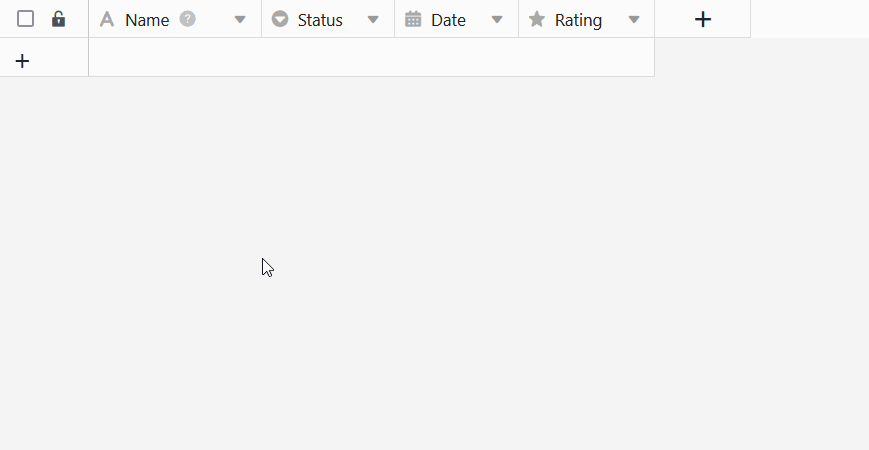

Se definir um **valor prede** finido para uma coluna, este é **automaticamente introduzido em cada nova linha** da tabela. Com valores predefinidos, pode poupar alguns cliques ao [adicionar novas linhas](). É claro que pode ajustar manualmente os valores introduzidos automaticamente mais tarde.

## Como definir valores por defeito

1. Clique no **ícone** triangular do menu **pendente**  à direita do nome da coluna para a qual pretende definir um valor predefinido.
2. Seleccione a opção **Definir valor por defeito**.
3. Introduzir o **valor proposto** desejado. Dependendo do tipo de coluna, existem várias opções para selecionar.
4. Confirmar o processo com o **botão Enter** ou **clicando** fora da janela de diálogo.
5. Se **criar** agora uma **nova linha**, o SeaTable introduz automaticamente os valores correspondentes. Pode então **ajustar** os dados como habitualmente.



Também é possível definir um valor por defeito diretamente ao [criar uma nova coluna]().

## Para que tipos de colunas é possível definir valores por defeito

Os valores predefinidos podem ser definidos para muitos, mas não todos, os [tipos de colunas no SeaTable](). As colunas cujo conteúdo é gerado automaticamente pelo SeaTable[(fórmulas](), [ficheiros](https://seatable.io/pt/docs/dateien-und-bilder/die-datei-spalte/) e [assinaturas](https://seatable.io/pt/docs/dateien-und-bilder/die-signatur-spalte/).

**Segue-se uma síntese dos tipos de colunas para os quais é possível definir valores propostos:**

| Tipo de coluna       | Suporta valores por defeito                                   |
| -------------------- | ------------------------------------------------------------- |
| Número automático    |                                    |
| Imagem               |                                    |
| Caixa de verificação |  |
| Ficheiro             |                                    |
| Data                 |  |
| Duração              |                                    |
| Selecção única       |  |
| Correio electrónico  |                                    |
| Criador              |                                    |
| Criado em            |                                    |
| Texto formatado      |  |
| Fórmula              |                                    |
| Fórmula para links   |                                    |
| Geoposição           |                                    |
| Último editor        |                                    |
| Selecção múltipla    |                                    |
| Empregados           |  |
| Classificação        |  |
| Botão                |                                    |
| Assinatura           |                                    |
| Texto                |  |
| URL                  |                                    |
| Número               |  |
| Última edição        |                                    |

## Valores por defeito referenciados em colunas de texto

Se especificar a referência **{creator.name}** ou **{creator.id}** como valor predefinido numa [coluna de texto](https://seatable.io/pt/docs/text-und-zahlen/die-spalten-text-und-formatierter-text/), o **nome** ou **ID do utilizador** que adicionou a linha é automaticamente introduzido.

## O âmbito dos valores por defeito

Os valores predefinidos aplicam-se **sempre que** é possível criar novas linhas:

- num [quadro]()
- numa [coluna de ligação]()
- via [botão](https://seatable.io/pt/docs/andere-spalten/zeilen-per-schaltflaeche-in-eine-andere-tabelle-kopieren/) (ação: "Copiar linha para outra tabela")
- através da [automatização](https://seatable.io/pt/docs/automationen/automations-aktionen/) (acções: "Adicionar linha" e "Adicionar nova entrada noutra tabela")
- no [calendário](https://seatable.io/pt/docs/plugins/neue-kalendereintraege-im-kalender-plugin-anlegen/), na [galeria](https://seatable.io/pt/docs/plugins/eine-neue-zeile-ueber-das-galerie-plugin-hinzufuegen/) ou no [plugin Kanban](https://seatable.io/pt/docs/plugins/anleitung-zum-kanban-plugin/)
- através de [formulários Web]()
- nas [páginas](https://seatable.io/pt/docs/seitentypen-in-universellen-apps/kanbanseiten-in-universellen-apps/) de [tabela](https://seatable.io/pt/docs/seitentypen-in-universellen-apps/tabellenseiten-in-universellen-apps/), [formulário](https://seatable.io/pt/docs/seitentypen-in-universellen-apps/formularseiten-in-universellen-apps/) e [Kanban](https://seatable.io/pt/docs/seitentypen-in-universellen-apps/kanbanseiten-in-universellen-apps/) das aplicações

## Valores por defeito em formulários Web

Para além dos valores por defeito definidos na tabela, [os formulários Web]() também permitem definir valores por defeito para os campos de formulário ligados às colunas. Também é possível definir se os utilizadores podem **alterar** estes valores por defeito ao preencherem o formulário.



## Valores por defeito nas aplicações

Os valores predefinidos definidos na base também afectam as linhas que são introduzidas nas **páginas de tabela, formulário e Kanban** das [aplicações universais](). O único [tipo de página](https://seatable.io/pt/docs/apps/seitentypen-in-der-universellen-app/) para o qual ainda é possível definir valores predefinidos na aplicação é a [página de formulário](https://seatable.io/pt/docs/seitentypen-in-universellen-apps/formularseiten-in-universellen-apps/). As definições funcionam exatamente da mesma forma que para os formulários Web: Para tal, active os cursores, como mostra a imagem acima.
