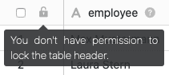
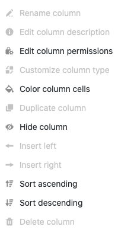

Wenn Sie über die notwendige Berechtigung verfügen, können Sie in jeder Tabelle den **Tabellenkopf sperren**, um das Hinzufügen, Verschieben und Bearbeiten von Spalten in der Tabelle zu verhindern. Der große Vorteil ist, dass Sie so mit einem Klick **alle Spalten gleichzeitig** sperren können.

Sinnvoll kann dies beispielsweise sein, wenn Sie mit anderen Benutzern gemeinsam in einer Tabelle arbeiten und nicht möchten, dass Änderungen an der **Spaltenstruktur** vorgenommen werden dürfen.



Wenn Sie lediglich **einzelne Spalten** Ihrer Tabelle für die Bearbeitung sperren möchten, können Sie dies über die [Spaltenberechtigungen]() erledigen.



## Tabellenkopf sperren

1. Öffnen Sie die **Tabelle**, in der Sie den Tabellenkopf sperren möchten.
2. Klicken Sie auf das **schwarze, offene Schloss** im Tabellenkopf.
   4. Wird das Schloss anschließend **rot** angezeigt, haben Sie den Tabellenkopf erfolgreich gesperrt.
   



Verwechseln Sie diese Funktion nicht mit dem **Schloss-Symbol in den Ansichts-Optionen**, mit dem Sie die Einstellungen einer [Tabellenansicht sperren]() können.



Bitte beachten Sie, dass der Kopf von Tabellen, die zu einer Gruppe gehören, ausschließlich von **Eigentümern** und **Administratoren** gesperrt werden kann. Einfache Gruppenmitglieder sind zur Sperrung **nicht** berechtigt und bekommen bei einem Klick auf das Schloss-Symbol folgenden Hinweis angezeigt:

## Auswirkungen der Sperrung

Nach der Sperrung des Tabellenkopfes können Sie der entsprechenden Tabelle **keine Spalten mehr hinzufügen**, bis die Sperrung wieder aufgehoben wird. Das **\[+\]-Symbol** zum [Hinzufügen einer Spalte]() wird Ihnen folglich in Tabellen mit gesperrtem Tabellenkopf **nicht** angezeigt.

Sie können auch keine Spalten mehr verschieben, wodurch die **Spaltenstruktur** auf jeden Fall gleich bleibt, bis die Sperrung endet.

Darüber hinaus können Sie nach der Sperrung eines Tabellenkopfes diverse **Einstellungen** an den Spalten der Tabelle **nicht** mehr vornehmen. Davon betroffen sind folgende Spalten-Einstellungen:

- Spalte umbenennen
- Spaltenbeschreibung hinzufügen
- Spaltentyp anpassen
- Spalte duplizieren
- Links (Spalte) einfügen
- Rechts (Spalte) einfügen
- Spalte löschen

Die betroffenen Optionen werden bei gesperrtem Tabellenkopf in den Spalten-Einstellungen **ausgegraut**.

Alle anderen **Spalten-Einstellungen** bleiben hingegen von der Sperrung unberührt und können auch bei gesperrtem Tabellenkopf weiterhin bearbeitet werden. Dazu zählen folgende Optionen:

- Formateinstellungen
- Spaltenberechtigungen bearbeiten
- Zellen der Spalte formatieren
- Ausblenden
- Aufsteigend sortieren
- Absteigend sortieren

## Sperrung aufheben

Um die Sperrung eines Tabellenkopfes wieder aufzuheben, klicken Sie einfach erneut auf das **(rote) Schloss** im Tabellenkopf.

Bei erfolgreicher Entsperrung wird wieder ein **schwarzes, offenes Schloss** angezeigt. Im Anschluss können Sie der Tabelle wieder Spalten hinzufügen und bestehende Spalten bearbeiten.

Bitte beachten Sie, dass der gesperrte Kopf von Tabellen, die zu einer Gruppe gehören, ausschließlich von **Eigentümern** und **Administratoren** der Gruppe wieder entsperrt werden kann. Einfache Gruppenmitglieder sind zur Entsperrung hingegen **nicht** berechtigt und bekommen bei einem Klick auf das Schloss-Symbol folgenden Hinweis angezeigt:

