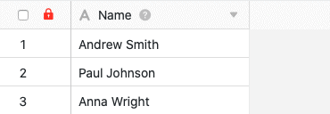

If you have the necessary permission, you can **lock** the **table header in** each table to prevent adding, moving and editing columns in the table. The big advantage is that this way you can lock **all columns at once** with one click.

This can be useful, for example, if you work together with other users in a table and do not want changes to the **column structure to** be allowed.



If you only want to lock **individual columns of** your table for editing, you can do this using the [column permissions]() button.



## Lock table header

1. open the **table** in which you want to lock the table header.
2. click on the **black, open lock** in the table header.
   Lock the table header](images/lock-the-table-head.jpg)4 If the lock is then displayed in **red**, you have successfully locked the table header.
   



Do not confuse this function with the **lock icon in the view options**, with which you can lock the settings of a [table view]().



Please note that the header of tables belonging to a group can only be locked by **owners** and **administrators**. Simple group members are **not** authorised to lock and will be shown the following message when they click on the lock symbol:

## Effects of the lock

Once the table header has been locked, you can **no longer add columns** to the corresponding table until the lock is cancelled again. The **\[+\]-symbol** for [adding a column]() is therefore **not** displayed in tables with a locked table header.

You can also no longer move columns, which means that the **column structure** remains the same in any case until the locking ends.

In addition, once a table header has been locked, you can no longer make various **settings** to the columns in the table. This affects the following column settings:

- Rename column
- Add column description
- Customise column type
- Duplicate column
- Insert left (column)
- Insert right (column)
- Delete column

The relevant options are **greyed out** in the column settings when the table header is locked.

However, all other **column settings** remain unaffected by the lock and can still be edited even if the table header is locked. These include the following options:

- Format settings
- Edit column authorisations
- Format column cells
- Hide
- Sort in ascending order
- Sort descending

## Unblock

To unblock a table header, simply click on the **(red) lock** in the table header again.

If unlocking is successful, a **black, open lock** is displayed again. You can then add columns to the table again and edit existing columns.

Please note that the locked header of tables that belong to a group can only be unlocked again by **owners** and **administrators** of the group. Simple group members are **not** authorised to unlock and will see the following message when they click on the lock symbol:

