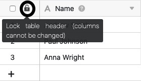
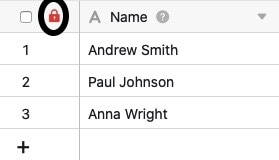
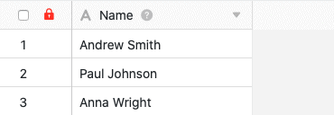
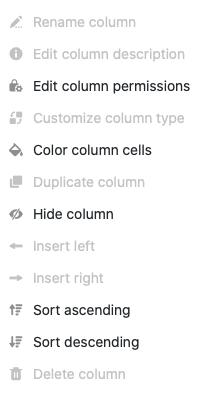
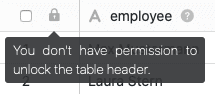

Si vous disposez de l'autorisation nécessaire, vous pouvez **verrouiller** l'**en-tête du tableau** dans chaque tableau afin d'empêcher l'ajout, le déplacement et la modification de colonnes dans le tableau. Le grand avantage est que vous pouvez ainsi bloquer **toutes les colonnes en même temps** en un seul clic.

Cela peut être utile, par exemple, si vous travaillez dans un tableau avec d'autres utilisateurs et que vous ne souhaitez pas que des modifications soient apportées à la **structure des colonnes**.



Si vous souhaitez uniquement bloquer l'édition de **certaines colonnes** de votre tableau, vous pouvez le faire via les [autorisations de colonne]().



## Verrouiller l'en-tête du tableau

1. Ouvrez le **tableau** dans lequel vous souhaitez verrouiller l'en-tête du tableau.
2. Cliquez sur le **cadenas noir ouvert** dans l'en-tête du tableau.

4. Si le cadenas s'affiche ensuite **en rouge**, vous avez réussi à verrouiller l'en-tête du tableau.



Ne confondez pas cette fonction avec le **Icône du cadenas dans les options d'affichage**qui vous permet de modifier les paramètres d'une [Verrouiller l'affichage des tableaux]() peuvent.



## Effets du blocage

Après le verrouillage de l'en-tête du tableau, vous ne pouvez plus **ajouter de colonne au tableau correspondant** jusqu'à ce que le verrouillage soit levé. L'icône **\+** pour [ajouter une colonne]() ne sera donc **pas affichée** dans les tableaux dont l'en-tête est verrouillé.

Vous ne pouvez plus non plus déplacer de colonnes, ce qui fait que la **structure des colonnes** reste en tout cas la même jusqu'à la fin du verrouillage.

En outre, après le verrouillage d'un en-tête de tableau, vous ne pouvez **plus** effectuer divers **réglages** sur les colonnes du tableau. Les réglages de colonnes suivants sont concernés :

- Renommer la colonne
- Ajouter une description de colonne
- Adapter le type de colonne
- Dupliquer une colonne
- Insérer à gauche (colonne)
- Insérer à droite (colonne)
- Supprimer la colonne

Les options concernées sont **grisées** dans les paramètres des colonnes lorsque l'en-tête du tableau est verrouillé.

En revanche, tous les autres **réglages de colonne** ne sont pas affectés par le blocage et peuvent toujours être modifiés même si l'en-tête du tableau est bloqué. Il s'agit notamment des options suivantes :

- Paramètres de format
- Modifier les autorisations de colonne
- Formater les cellules de la colonne
- Masquer
- Trier par ordre croissant
- Trier par ordre décroissant

## Débloquer

Pour débloquer un en-tête de tableau, il suffit de cliquer à nouveau sur le **verrou (rouge)** dans l'en-tête du tableau.

Si le déverrouillage est réussi, un **verrou noir ouvert** s'affiche à nouveau. Ensuite, vous pouvez à nouveau ajouter des colonnes au tableau et modifier les colonnes existantes.

Veuillez noter que l'en-tête verrouillé des tableaux appartenant à un groupe ne peut être déverrouillé que par les **propriétaires** et les **administrateurs** du groupe. Les simples membres du groupe ne sont par contre **pas autorisés** à déverrouiller et reçoivent la remarque suivante lorsqu'ils cliquent sur le symbole du cadenas :

