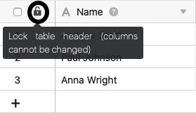
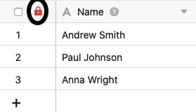
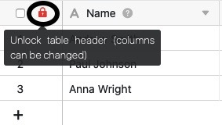
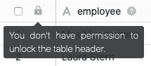

Если у вас есть необходимые полномочия, вы можете заблокировать **заголовок таблицы** в каждой таблице, чтобы предотвратить добавление, перемещение и редактирование столбцов в таблице. Большим преимуществом является то, что вы можете заблокировать **все столбцы одновременно** одним щелчком мыши.

Это может быть полезно, например, если вы работаете в таблице вместе с другими пользователями и не хотите, чтобы в структуру **столбцов** вносились изменения.



Если вы хотите заблокировать для редактирования только **отдельные столбцы** вашей таблицы, вы можете сделать это с помощью [разрешения столбцов]().



## Заблокировать заголовок таблицы

1. откройте **таблицу**, в которой нужно заблокировать заголовок таблицы.
2. нажмите на **черный открытый замок** в заголовке таблицы.
   4 Если замок отображается **красным**, значит, заголовок таблицы успешно заблокирован.
   



Не путайте эту функцию с **значком блокировки в опциях вида**, с помощью которого можно заблокировать настройки [вида таблицы]().



Обратите внимание, что заголовок таблиц, принадлежащих группе, может быть заблокирован только **владельцами** и **администраторами**. Простые члены группы **не** имеют права блокировать, и при нажатии на символ блокировки им будет показано следующее сообщение:

## Последствия блокировки

После блокировки заголовка таблицы вы больше не сможете **добавлять столбцы** в соответствующую таблицу, пока блокировка не будет отменена. Поэтому **+-символ** для [добавления колонки]() **не** отображается в таблицах с заблокированной шапкой таблицы.

Вы также больше не можете перемещать столбцы, что означает, что **структура столбцов** остается неизменной в любом случае до окончания блокировки.

Кроме того, после блокировки заголовка таблицы вы больше не можете выполнять различные **настройки** столбцов таблицы. Это влияет на следующие настройки столбцов:

- Переименовать столбец
- Добавить описание столбца
- Настроить тип столбца
- Дублировать колонку
- Вставить слева (столбец)
- Вставить справа (столбец)
- Удалить колонку

Соответствующие опции **затемнены** в настройках столбцов, когда заголовок таблицы заблокирован.

Однако все остальные **настройки столбцов** остаются незатронутыми блокировкой и могут быть отредактированы, даже если заголовок таблицы заблокирован. К ним относятся следующие параметры:

- Настройки формата
- Редактировать полномочия столбцов
- Форматировать ячейки столбцов
- Скрыть
- Сортировать по возрастанию
- Сортировать по убыванию

## Разблокировать

Чтобы разблокировать заголовок таблицы, просто снова нажмите на **(красный) замок** в заголовке таблицы.

Если разблокировка прошла успешно, на экране снова появится **черный открытый замок**. После этого можно снова добавлять столбцы в таблицу и редактировать существующие столбцы.

Обратите внимание, что заблокированный заголовок таблиц, принадлежащих группе, может быть снова разблокирован только **владельцами** и **администраторами** группы. Простые члены группы **не** имеют права разблокировки и при нажатии на символ замка увидят следующее сообщение:

