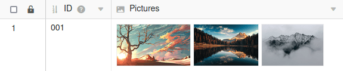

Для записи **файлов** и **изображений** в SeaTable доступны два типа колонок с одинаковым названием. [Колонка изображений]() - это [колонка файлов](https://seatable.io/ru/docs/datei-und-bildanhaenge/die-datei-spalte/) с ограниченным доступом, поскольку она принимает только специальные форматы файлов изображений. Это ограничение может быть очень практичным в некоторых приложениях.

## Колонка изображений

Тип колонки **Image** хранит любое количество **файлов** изображений в форматах **BMP, GIF, ICO, JPG, PNG, SVG и TIF**. Таким образом, колонка Image - это колонка файлов, ограниченная форматами файлов изображений и предлагающая **предварительный просмотр** в виде уменьшенного изображения.

## Колонка файлов

В столбце типа **Файл** хранится любое количество файлов **любого типа**. Дополнительные функции, такие как **переименование**, **удаление** и **загрузка**, а также **онлайн-редактирование документов Office**, облегчают работу с введенными файлами.

## Текущие ограничения

- **Поиск** **SeaTable** не может искать по именам файлов.
- В настоящее время вы **не можете** использовать столбцы файлов и изображений в формулах.
