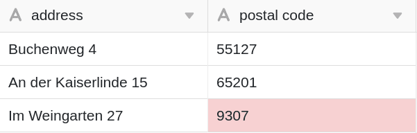

Bei der Verwendung von Textspalten in Ihren Tabellen haben Sie die Möglichkeit, Eingaben zu validieren. Mithilfe einer Validierung, bei der reguläre Ausdrücke (Regular Expressions) unterstützt werden, können Sie Zellwerte überprüfen und Zellen mit einem vom gültigen Format abweichenden Inhalt hervorheben.



Grundsätzlich stehen Ihnen zwei verschiedene Wege für die Validierung von Eingaben in Text-Spalten zur Verfügung. Eine Validierung kann sowohl im Zuge des **Hinzufügens einer neuen** [Text-Spalte]() erfolgen.



## Eingaben validieren

1. Falls Sie eine Validierung der Eingaben in einer bereits angelegten Text-Spalte durchführen möchten, klicken Sie zunächst auf das **Dreieck-Symbol**  der entsprechenden Spalte.
2. Wählen Sie im Drop-down-Menü **Spaltentyp anpassen** aus.
3. Aktivieren Sie den Regler **Eingabe validieren**
4. Definieren Sie ein **Zielformat**.
5. Bestätigen Sie mit **Abschicken**.
   

## Folge der Validierung

Nach erfolgreicher Validierung werden die **Zellen** mit einem vom Zielformat **abweichenden Inhalt** rot hervorgehoben.

## Reguläre Ausdrücke

Für die Validierung Ihrer Eingaben in Text-Spalten unterstützt SeaTable **reguläre Ausdrücke (regular expressions)**. In der folgenden Tabelle finden Sie einige Beispiele:

| Regulärer Ausdruck              | Funktion                                                                     |
| ------------------------------- | ---------------------------------------------------------------------------- |
| \[123456\]                      | Prüfen, ob eine Eingabe einer Schulnote von 1 bis 6 entspricht.              |
| \[1-9\]\[0-9\]?\[0-9\]?\[a-z\]? | Format einer deutschen Hausnummer überprüfen (3 Ziffern + 1 Buchstabe)       |
| \[0-9\]{5}                      | Prüfung des Formats deutscher Postleitzahlen (5x eine Zahl zwischen 0 und 9) |
| \[0-9/. \\-\]+                  | Prüfung des Formats einer Telefonnummer                                      |
| Max.\*Mustermann                | Suche nach einem möglichen zweiten Vornamen eines Autors                     |


