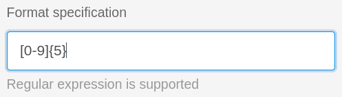

Cuando utilice columnas de texto en sus tablas, tiene la opción de validar las entradas. Mediante la validación, que admite expresiones regulares, puede comprobar los valores de las celdas y resaltar las celdas cuyo contenido se desvíe del formato válido.



## Validar entradas

1. Si desea validar las entradas de una columna de texto ya creada, haga clic primero en el **símbolo del triángulo**  de la columna correspondiente.
2. Seleccione **Personalizar tipo de columna** en el menú desplegable.
3. Activar el control deslizante **Validar entrada**
4. Definir un **formato de destino**.
5. Confirme con **Enviar**.

## Consecuencia de la validación

Tras una validación correcta, las **celdas** cuyo **contenido se desvía** del formato objetivo se resaltan en rojo.

## Expresiones regulares

SeaTable soporta **expresiones regulares** para validar sus entradas en columnas de texto.  
Puede encontrar algunos ejemplos en la siguiente tabla:

| Expresión regular               | Función                                                                          |     |     |     |     |
| ------------------------------- | -------------------------------------------------------------------------------- | --- | --- | --- | --- |
| \[123456\]                      | Compruebe si una entrada corresponde a un curso escolar de 1 a 6.                |     |     |     |     |
| \[1-9\]\[0-9\]?\[0-9\]?\[a-z\]? | Comprobar el formato de un número de casa alemán (3 dígitos + 1 letra)           |     |     |     |     |
| \[0-9\]{5}                      | Comprobar el formato de los códigos postales alemanes (5x un número entre 0 y 9) |     |     |     |     |
| \[0-9/. \\-\]+                  | Comprobar el formato de un número de teléfono                                    |     |     |     |     |
| Max\*Mustermann                 | Buscar un posible segundo nombre de un autor                                     |     |     |     |     |


