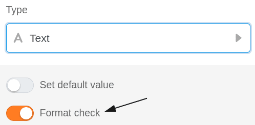
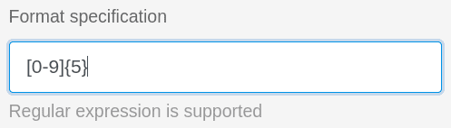
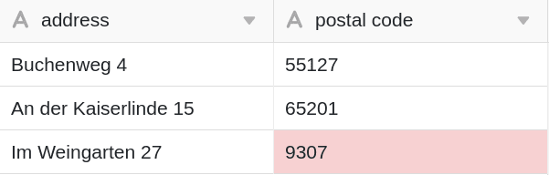

При использовании текстовых столбцов в таблицах у вас есть возможность проверки записей. С помощью валидации, которая поддерживает регулярные выражения, можно проверить значения ячеек и выделить ячейки с содержимым, отклоняющимся от допустимого формата.



## Удостоверить входы

1. Если вы хотите проверить записи в уже созданном текстовом столбце, сначала нажмите на **символ треугольника**  соответствующего столбца.
2. В выпадающем меню выберите **Настроить тип колонки**.
3. Активируйте ползунок **ввода Validate**
4. Определите **целевой формат**.
5. Подтвердите с помощью кнопки **Отправить**.

## Последствия валидации

После успешной проверки **ячейки** с **содержимым, отклоняющимся от** целевого формата, выделяются красным цветом.

## Регулярные выражения

SeaTable поддерживает **регулярные выражения** для проверки записей в текстовых колонках.  
Некоторые примеры вы можете найти в следующей таблице:

| Регулярное выражение            | Функция                                                          |     |     |     |     |
| ------------------------------- | ---------------------------------------------------------------- | --- | --- | --- | --- |
| \[123456\]                      | Проверьте, соответствует ли запись школьному классу от 1 до 6.   |     |     |     |     |
| \[1-9\]\[0-9\]?\[0-9\]?\[a-z\]? | Контрольный формат немецкого номера дома (3 цифры + 1 буква)     |     |     |     |     |
| \[0-9\]{5}                      | Проверка формата немецких почтовых индексов (5x число от 0 до 9) |     |     |     |     |
| \[0-9/. \\-\]+                  | Проверка формата телефонного номера                              |     |     |     |     |
| Макс.\*Мустерманн               | Поиск возможного отчества автора                                 |     |     |     |     |


