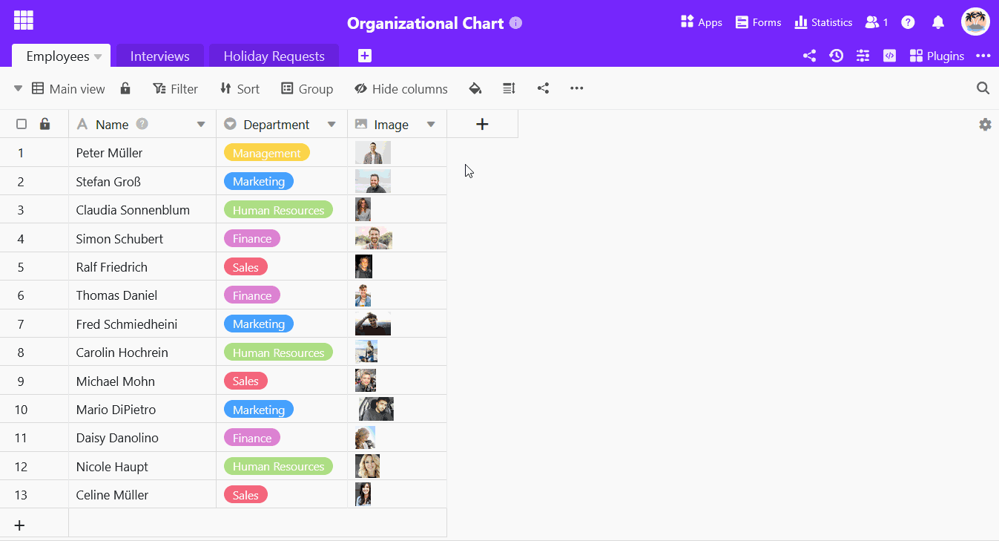
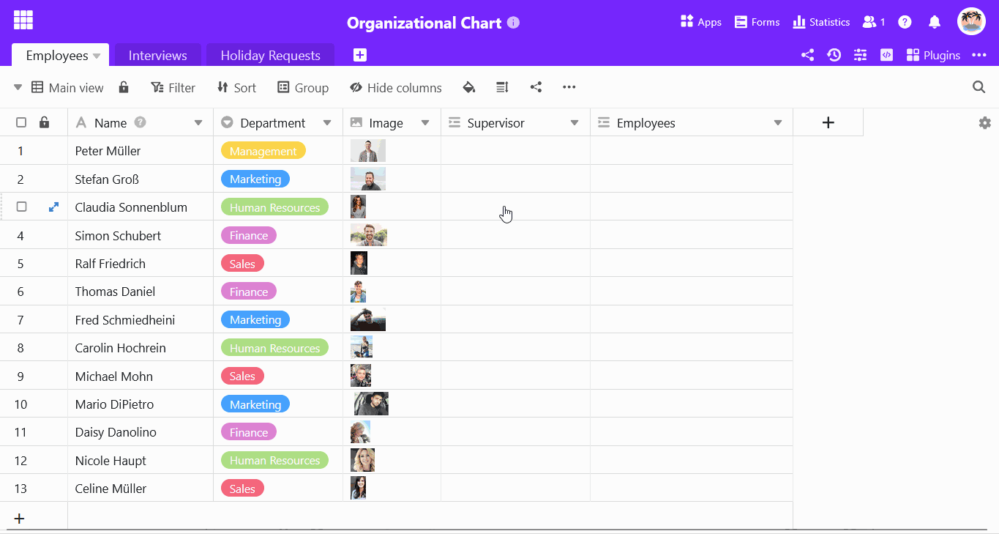

Mithilfe einer **Verknüpfungsspalte** können Sie in SeaTable nicht nur [mehrere Tabellen miteinander verlinken](https://seatable.io/docs/verknuepfungen/wie-man-tabellen-in-seatable-miteinander-verknuepft/), sondern auch **Datensätze in ein und derselben Tabelle miteinander in Beziehung setzen**.

Dies ergibt vor allem Sinn, wenn die Daten in Ihrer Tabelle eine **Hierarchie** aufweisen.

## Eine Verknüpfung innerhalb einer Tabelle hinzufügen

1. Klicken Sie auf das **Plus-Symbol** rechts neben dem letzten Spaltenkopf.
2. Tragen Sie den **Namen für die übergeordnete Spalte** in das Eingabefeld ein.
3. Wählen Sie als Spaltentyp **Verknüpfung zu anderen Einträgen**.
4. Suchen Sie **die aktuelle Tabelle** als zu verknüpfende Tabelle aus.
5. Bestätigen Sie mit **Abschicken**.
6. SeaTable fügt automatisch eine **zweite Spalte für die untergeordneten Einträge** hinzu.



Die beiden Verknüpfungsspalten sind **untrennbar** miteinander verbunden. Wenn Sie eine der beiden Spalten **löschen**, verschwindet direkt auch die andere. Falls Sie nur eine der beiden Spalten in Ihrer Tabelle sehen möchten, können Sie jedoch die andere [ausblenden]().



## Datensätze in einer Tabelle miteinander verknüpfen

1. Klicken Sie in eine **Zelle der Verknüpfungsspalte** und dann auf das erscheinende **Plus-Symbol**.
2. Nun werden Ihnen die verfügbaren **Zeilen der Tabelle** aufgelistet. Klicken Sie die Zeile(n) an, die Sie mit der ausgewählten Zeile verlinken möchten.
3. In beiden Verknüpfungsspalten wird Ihnen sofort **der jeweils verbundene Eintrag** angezeigt.



## Warum gibt es zwei Spalten für dieselbe Verknüpfung?

Wenn Sie eine Verknüpfungsspalte anlegen, die Einträge in ein und derselben Tabelle verknüpft, dann erstellt SeaTable automatisch eine zweite Verknüpfungsspalte.

- In der **ersten** Verknüpfungsspalte sehen Sie die Datensätze, die einer Zeile **übergeordnet** sind.
- In der **zweiten** Verknüpfungsspalte sehen Sie die Datensätze, die einer Zeile **untergeordnet** sind.

Die **Eltern und Kinder** einer Eltern-Kind-Beziehung werden also in separaten Spalten erfasst und dargestellt. Damit stellt SeaTable sicher, dass bei jeder Verknüpfung ein übergeordneter und ein untergeordneter Datensatz existiert.



## Weiterführende Artikel

- Wenn Sie hierarchische Verknüpfungen anschaulich **visualisieren** wollen, können wir Ihnen wärmstens das [Organigramm-Plugin](https://seatable.io/docs/plugins/anleitung-zum-organigramm-plugin/) empfehlen.
- Für alle weiteren Fragen zum Umgang mit Verknüpfungsspalten konsultieren Sie bitte den Artikel [Wie man Tabellen in SeaTable miteinander verknüpft](https://seatable.io/docs/verknuepfungen/wie-man-tabellen-in-seatable-miteinander-verknuepft/).
