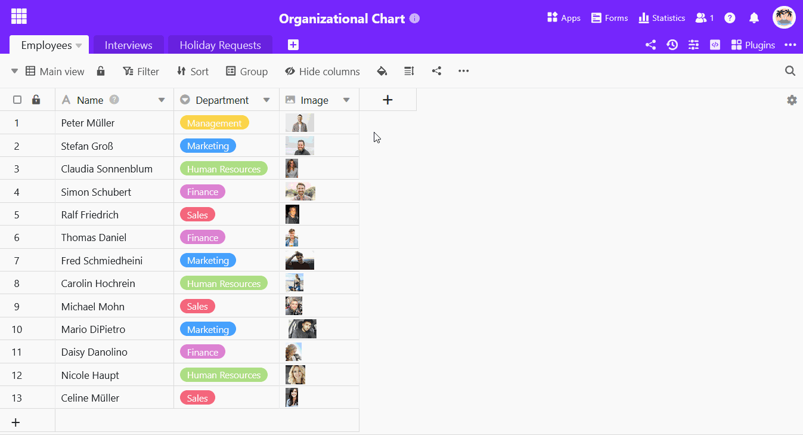
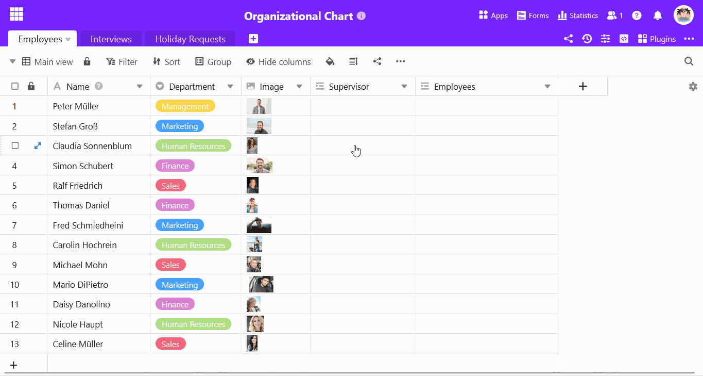

Une **colonne de liaison** dans SeaTable permet non seulement de [lier plusieurs tables entre elles](https://seatable.io/fr/docs/verknuepfungen/wie-man-tabellen-in-seatable-miteinander-verknuepft/), mais aussi **de mettre en relation les enregistrements d'une même table**.

Cela a surtout du sens si les données de votre tableau présentent une **hiérarchie**.

## Ajouter un lien dans un tableau

1. Cliquez sur le **symbole plus** à droite du dernier en-tête de colonne.
2. Saisissez le **nom de la colonne supérieure** dans le champ de saisie.
3. Sélectionnez **Lien vers d'autres entrées** comme type de colonne.
4. Recherchez **la table actuelle** comme table à lier.
5. Confirmez en cliquant sur **Envoyer**.
6. SeaTable ajoute automatiquement une **deuxième colonne pour les entrées subordonnées**.



## Relier des enregistrements dans une table

1. Cliquez dans une **cellule de la colonne des liens**, puis sur le **symbole plus** qui apparaît.
2. Les **lignes** disponibles **du tableau** sont maintenant listées. Cliquez sur la ou les lignes que vous souhaitez lier à la ligne sélectionnée.
3. Dans les deux colonnes de liens, **l'entrée correspondante s** 'affiche immédiatement.



## Pourquoi y a-t-il deux colonnes pour le même lien ?

Si vous créez une colonne de jointure qui relie des entrées dans un même tableau, SeaTable crée automatiquement une deuxième colonne de jointure.

- Dans la **première** colonne de liens, vous voyez les enregistrements qui sont **supérieurs** à une ligne.
- Dans la **deuxième** colonne de liens, vous voyez les enregistrements qui sont **subordonnés** à une ligne.

Les **parents et les enfants** d'une relation parent-enfant sont donc saisis et représentés dans des colonnes séparées. SeaTable garantit ainsi l'existence d'un enregistrement parent et d'un enregistrement enfant pour chaque lien.



## Articles connexes

- Si vous souhaitez **visualiser** clairement les liens hiérarchiques, nous vous recommandons vivement le [plug-in Organigramme](https://seatable.io/fr/docs/plugins/anleitung-zum-organigramm-plugin/).
- Pour toute autre question concernant l'utilisation des colonnes de jointure, veuillez consulter l'article [Comment lier des tableaux dans SeaTable](https://seatable.io/fr/docs/verknuepfungen/wie-man-tabellen-in-seatable-miteinander-verknuepft/).
