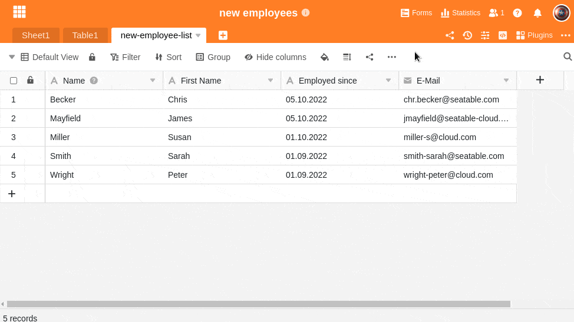

Dependiendo de los **valores** que desee registrar en SeaTable, puede asignarles diferentes tipos **de** columna. [Aquí]() encontrará un resumen de los 25 tipos de columnas de SeaTable.

Es posible cambiar el tipo de columna posteriormente. Aquí puede averiguar cómo **cambiar** el tipo de columna **a posteriori**.

## Cómo ajustar el tipo de columna

1. Haga clic en el **icono** triangular **desplegable**  situado a la derecha del nombre de la columna cuyo tipo desea personalizar.
2. Seleccione la opción **Personalizar tipo de columna**.
3. Asigne un nuevo **tipo de** columna a la columna y realice más **ajustes** específicos si es necesario.
4. Confirme el proceso haciendo clic en **Enviar**.



## Ajuste de la primera columna

La **primera columna** de una tabla **sólo** admite **6 de los 25 tipos de columnas**. Éstos son

- [Texto]()
- [Número]()
- [Fecha]()
- [Selección única]()
- [Número automático]()
- [Fórmula]()

## Aviso de pérdida de datos

La **conversión** de determinados tipos de columnas suele provocar **pérdidas de datos** no deseadas. Este es el caso, por ejemplo, de las columnas de [archivos]() o cuando convierte [columnas de texto]() en columnas numéricas. En estos casos, SeaTable muestra un **mensaje de advertencia** preguntando si realmente desea cambiar el tipo de columna.
