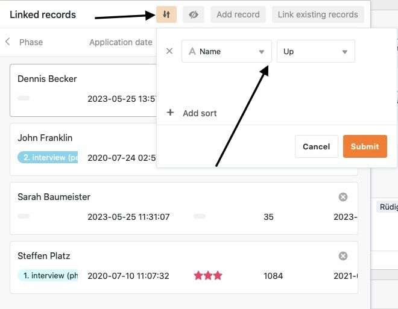

SeaTable ermöglicht es Ihnen, Informationen aus unterschiedlichen Tabellen miteinander zu verknüpfen. Verwenden Sie hierfür den Spaltentyp **Verknüpfung zu anderen Einträgen**.

## So können Sie zwei Tabellen miteinander verknüpfen

1. Legen Sie eine neue Spalte an und wählen Sie den Spaltentyp **Verknüpfung zu anderen Einträgen**.
2. Geben Sie der Spalte einen **Namen**.
3. Wählen Sie unter **Tabelle für die Verknüpfung wählen** die Tabelle aus, deren Einträge Sie mit der aktuellen Tabelle verlinken wollen.
4. Klicken Sie auf **Abschicken**.
5. Der Inhalt der neuen Spalte ist noch leer. Um sie zu füllen, können Sie **bestehende Einträge verlinken** oder **neue Zeilen hinzufügen**.

Sobald Tabellen miteinander verknüpft sind, können Sie über den **Link-Dialog** die Informationen der verknüpften Einträge aufrufen. Dazu klicken Sie in einer **Zelle** der Verknüpfungsspalte auf das **Doppelpfeil-Symbol** oder machen einen **Doppelklick**. In dem sich öffnenden Link-Dialog werden die **verknüpften Einträge** aufgelistet. Klicken Sie auf einen Eintrag, um sich in einem zusätzlichen Fenster die **Zeilendetails** anzusehen.

## Bestehende Einträge verlinken

1. Klicken Sie in eine **Zelle** der **Verknüpfungsspalte** und dann auf das erschienene **Plus-Symbol**.
2. Nun werden Ihnen die verfügbaren **Zeilen der verknüpften Tabelle** aufgelistet. Wählen Sie die Zeile(n) aus, die Sie mit der Zeile Ihrer aktuellen Tabelle verlinken möchten.
3. In der Verknüpfungsspalte wird Ihnen jede Zeile sofort **als verlinkter Eintrag** angezeigt.
   

Über die **integrierte Suchfunktion** im Link-Dialog können Sie die Einträge der verknüpften Tabelle durchsuchen, um schnell die gewünschte Zeile zu finden.



## Neue Zeile hinzufügen

Sie können über den Link-Dialog sogar eine **neue Zeile** zu einer **verknüpften Tabelle** hinzufügen, ohne in diese Tabelle wechseln zu müssen. Im Anschluss wird die Zeile in der verknüpften Tabelle unter den bestehenden Datensätzen hinzugefügt und als verlinkter Eintrag in der Verknüpfungsspalte der geöffneten Tabelle angezeigt.

1. Machen Sie einen **Doppelklick** auf die **Zelle** einer **Verknüpfungsspalte** oder klicken Sie auf das blaue **Doppelpfeil-Symbol**, um den Link-Dialog zu öffnen.
   3. Klicken Sie auf **Zeile hinzufügen**.
   5. Füllen Sie im sich öffnenden Fenster die verschiedenen **Tabellenspalten** aus.
   7. Klicken Sie auf **Abschicken**, um die neue Zeile anzulegen.
   9. Die **neue Zeile** wird automatisch der **verknüpften Tabelle** hinzugefügt und in der aktuell geöffneten Tabelle als **verlinkter Eintrag** in der Verknüpfungsspalte angezeigt.

## Bestehende Einträge einer verknüpften Tabelle bearbeiten

1. Klicken Sie in eine **Zelle** der Verknüpfungsspalte.
2. Klicken Sie auf den **verlinkten Eintrag**, den Sie bearbeiten möchten.
3. Die **Zeilendetails** öffnen sich. Nehmen Sie dort die gewünschten **Änderungen** vor.
4. **Schließen** Sie das Fenster, um die Änderungen zu **speichern**.

## Verlinkungen entfernen

In einer Verknüpfungsspalte verlinkte Einträge können Sie mit nur wenigen Klicks wieder entfernen. Öffnen Sie hierzu einfach den **Link-Dialog** der entsprechenden Verknüpfungsspalte und klicken Sie neben dem gewünschten Eintrag rechts auf das **X-Symbol**.

 

## Einstellungen der Verknüpfungsspalte

Eine Verknüpfungsspalte erlaubt Ihnen verschiedene Einstellungen, die Sie ganz leicht vornehmen und ändern können. Klicken Sie dazu im Tabellenkopf auf das dreieckige **Drop-down-Symbol** der Verknüpfungsspalte und dann auf **Einstellungen**.

### Auswahl der verknüpften Spalte aus der verlinkten Tabelle

Im Drop-down-Menü können Sie zunächst die **Spalte der verknüpften Tabelle** auswählen, deren **Einträge** in der Verknüpfungsspalte angezeigt werden sollen.

### Verknüpfungen auf eine Zeile einschränken

Durch Aktivieren des entsprechenden Reglers können Sie die Verknüpfung auf **maximal eine Zeile** beschränken. Ist diese Einstellung aktiv, kann in jeder Zelle der Verknüpfungsspalte nur noch jeweils **ein verlinkter Eintrag** hinzugefügt werden.

Wenn Sie einer Zelle bereits einen verknüpften Eintrag hinzugefügt haben, werden die Optionen zum Hinzufügen weiterer Einträge **nicht** mehr angezeigt.

Sinnvoll kann diese Einstellung beispielsweise sein, wenn eine Rechnung mit der dazugehörigen Bestellung aus einer anderen Tabelle verknüpft werden soll – wenn also die verknüpften Datensätze logische **Paare** bilden. In diesem Fall könnte das Hinzufügen von weiteren Verknüpfungen zu Verwirrung führen und Arbeitsprozesse negativ beeinträchtigen.

### Verknüpfungen auf eine Ansicht einschränken

Durch die Aktivierung dieser Einstellung können Sie Verknüpfungen auf **eine Ansicht** der verknüpften Tabelle beschränken. Dazu legen Sie eine zuvor definierte **Ansicht** der verknüpften Tabelle fest. In der Verknüpfungsspalte können Sie anschließend **ausschließlich** die Einträge dieser Ansicht verlinken. Das Verknüpfen von Einträgen anderer Ansichten ist dann **nicht** mehr möglich.

Diese Einstellung ergibt vor allem bei [gefilterten Ansichten](https://seatable.io/docs/ansichtsoptionen/filtern-von-eintraegen-in-einer-ansicht/) Sinn, um die Auswahl an verknüpfbaren Datensätzen einzugrenzen. In Kombination mit der [Beschränkung der Verknüpfung auf eine Zeile](https://seatable.io/docs/verknuepfungen/wie-man-tabellen-in-seatable-miteinander-verknuepft/#7-toc-title) kann Ihnen diese Einstellung behilflich sein, wenn Sie gezielt **einzelne Einträge** in Ihren Tabellen verknüpfen möchten.

### Verlinkung von bestehenden Einträgen verhindern

In den Einstellungen einer Verknüpfungsspalte können Sie durch Aktivieren eines entsprechenden Reglers auch die Verlinkung von bestehenden Einträgen verhindern. Ist der Regler **aktiviert**, unterstützt die entsprechende Verknüpfungsspalte **ausschließlich** das Hinzufügen von **neuen Zeilen** bzw. Einträgen.

Bereits bestehende Einträge in der verknüpften Tabelle können dann in der Spalte **nicht** mehr verlinkt werden. Einträge, die bereits in der Spalte verlinkt wurden, bleiben von der Einstellung jedoch **unberührt**.

## Ansichtsoptionen des Link-Dialogs

Im Link-Dialog einer Verknüpfungsspalte stehen Ihnen zudem verschiedene Ansichtsoptionen zur Verfügung.

### Größe des Fensters anpassen

Um alle verlinkten Einträge auf einen Blick zu haben, können Sie die **Größe** des Link-Dialog-Fensters anpassen. Fahren Sie hierzu einfach mit der Maus über einen der äußeren Ränder, bis sich der Cursor in einen **Doppelpfeil** verwandelt, und ziehen Sie den Rand mit gedrückter Maustaste in die gewünschte Richtung.

### Spaltenbreite anpassen

Damit mehr Spalteneinträge der verlinkten Zeilen in das Fenster passen, können Sie auch die **Breite** der angezeigten **Spalten** im Link-Dialog anpassen. Fahren Sie hierzu mit der Maus über den **Bereich zwischen zwei Spaltennamen**, bis sich der Cursor in einen **Doppelpfeil** verwandelt, und ziehen Sie die unsichtbare Begrenzungslinie mit gedrückter Maustaste nach links oder rechts, bis Sie die gewünschte **Spaltenbreite** erreicht haben.

### Spalten ausblenden

Um den Link-Dialog noch übersichtlicher zu gestalten, können Sie beliebig viele Spalten der verknüpften Einträge mit einem Klick auf das **Augen-Symbol** ausblenden. Es öffnet sich ein Fenster, in dem Sie die einzelnen Spalten mit Reglern **(de-)aktivieren** können. Dementsprechend werden die Spalten in der Übersicht der verlinkten Einträge ausgeblendet oder angezeigt.

### Einträge sortieren

Mit einem Klick auf die **Pfeil-Symbole** können Sie die verlinkten Einträge im Link-Dialog **sortieren**. Nutzen Sie diese Funktion beispielsweise, um sich verknüpfte Einträge anhand einer Textspalte in alphabetischer Reihenfolge anzeigen zu lassen oder sie nach einer anderen Spalte zu ordnen.



## Häufige Fragen

 Ich finde diesen Spaltentyp nicht. Kann ich keine Verlinkung erstellen?

|||

Die Link-Spalte steht Ihnen in jedem SeaTable Abonnement zur Verfügung. Wahrscheinlich versuchen Sie jedoch den Spaltentyp einer existierenden Spalte zu ändern. Beim [Ändern des Spaltentyps]() steht Ihnen der Spaltentyp **Verknüpfung zu anderen Einträgen** tatsächlich _nicht_ zur Verfügung. Legen Sie stattdessen eine **neue Spalte** an und schon wird Ihnen der gewünschte Spaltentyp angeboten.


