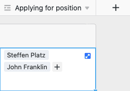
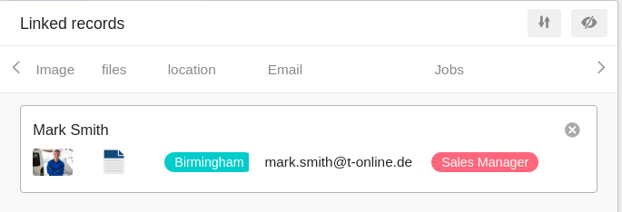
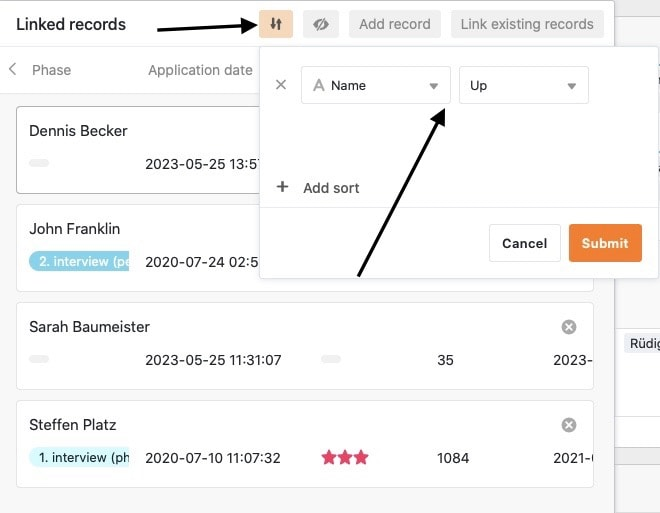

SeaTable vous permet de relier entre elles des informations provenant de différents tableaux. Pour ce faire, utilisez le type de colonne **Lien vers d'autres entrées**.

## Voici comment lier deux tableaux

1. Créez une nouvelle colonne et sélectionnez le type de colonne **Lien vers d'autres entrées**.
2. Donnez un **nom** à la colonne.
3. Sous **Sélectionner une table pour le lien**, sélectionnez la table dont vous souhaitez lier les entrées à la table actuelle.
4. Cliquez sur **Envoyer**.
5. Le contenu de la nouvelle colonne est encore vide. Pour la remplir, vous pouvez **lier des entrées existantes** ou **ajouter de nouvelles lignes**.

Dès que les tableaux sont liés entre eux, vous pouvez utiliser la **boîte de dialogue des liens** pour accéder aux informations des entrées liées. Pour ce faire, cliquez sur le **symbole de la double flèche** dans une **cellule** de la colonne de liaison ou faites un **double clic**. Les **entrées liées** sont listées dans la boîte de dialogue de lien qui s'ouvre. Cliquez sur une entrée pour voir les **détails de la ligne** dans une fenêtre supplémentaire.

## Lier des entrées existantes

1. Cliquez dans une **cellule** de la **colonne des liens**, puis sur le **symbole plus** qui apparaît.
2. Une liste des **lignes** disponibles **du tableau lié** s'affiche alors. Sélectionnez la ou les lignes que vous souhaitez lier à la ligne de votre tableau actuel.
3. Dans la colonne des liens, chaque ligne s'affiche immédiatement **comme une entrée liée**.



La **fonction de recherche intégrée** dans la boîte de dialogue du lien permet de parcourir les entrées du tableau lié afin de trouver rapidement la ligne souhaitée.



## Ajouter une nouvelle ligne

Vous pouvez même ajouter une **nouvelle ligne** à une **table liée à l** 'aide de la boîte de dialogue de lien, sans devoir passer dans cette table. La ligne est ensuite ajoutée dans la table liée parmi les enregistrements existants et s'affiche en tant qu'entrée liée dans la colonne de lien de la table ouverte.

1. **Double-cliquez** sur la **cellule** d'une **colonne de lien** ou cliquez sur l'**icône** bleue **à double flèche** pour ouvrir la boîte de dialogue de lien.

3. Cliquez sur **Ajouter une ligne**.

5. Dans la fenêtre qui s'ouvre, remplissez les différentes **colonnes du tableau**.

7. Cliquez sur **Envoyer** pour créer la nouvelle ligne.

9. La **nouvelle ligne** est automatiquement ajoutée au **tableau lié** et s'affiche dans le tableau actuellement ouvert en tant qu'**entrée liée** dans la colonne de lien.

## Modifier les entrées existantes d'un tableau lié

1. Cliquez dans une **cellule** de la colonne des liens.
2. Cliquez sur l'**entrée liée** que vous souhaitez modifier.
3. Les **détails de la ligne** s'ouvrent. Effectuez-y les **modifications** souhaitées.
4. **Fermez** la fenêtre pour **enregistrer** les modifications.

## Supprimer les liens

Vous pouvez supprimer les entrées liées dans une colonne de liens en quelques clics seulement. Pour ce faire, il vous suffit d'ouvrir la **boîte de dialogue des liens** de la colonne de liens correspondante et de cliquer sur le **symbole X** à droite de l'entrée souhaitée.



## Paramètres de la colonne des liens

Une colonne de liens vous permet d'effectuer et de modifier facilement différents réglages. Pour ce faire, cliquez dans l'en-tête du tableau sur l'**icône** triangulaire **déroulante** de la colonne de liens, puis sur **Paramètres**.

### Sélection de la colonne liée dans le tableau lié

Dans le menu déroulant, vous pouvez d'abord sélectionner la **colonne du tableau lié** dont les **entrées** doivent être affichées dans la colonne de lien.

### Limiter les liens à une seule ligne

En activant le curseur correspondant, vous pouvez limiter le lien à **une ligne au maximum**. Si ce paramètre est activé, **une seule entrée liée** peut être ajoutée dans chaque cellule de la colonne de lien.

Si vous avez déjà ajouté une entrée liée à une cellule, les options permettant d'ajouter d'autres entrées ne sont **plus** affichées.

Ce paramètre peut par exemple être utile lorsqu'une facture doit être liée à la commande correspondante d'une autre table - lorsque les enregistrements liés forment donc des **paires** logiques. Dans ce cas, l'ajout d'autres liens pourrait entraîner une certaine confusion et nuire aux processus de travail.

### Limiter les raccourcis à une seule vue

En activant ce paramètre, vous pouvez limiter les liens à **une vue** du tableau lié. Pour ce faire, vous devez définir une **vue** du tableau lié. Dans la colonne des liens, vous pouvez ensuite lier **uniquement** les entrées de cette vue. Il n'est alors **plus** possible de lier des entrées d'autres vues.

Ce paramètre est particulièrement utile pour les [vues filtrées](#7-toc-title), ce paramètre peut vous être utile si vous souhaitez lier de manière ciblée **des entrées individuelles** dans vos tableaux.

### Empêcher la création de liens vers des entrées existantes

Dans les paramètres d'une colonne de liens, vous pouvez également empêcher la création de liens vers des entrées existantes en activant le curseur correspondant. Si le curseur **est activé**, la colonne de liens correspondante ne prend en charge **que** l'ajout de **nouvelles lignes** ou entrées.

Les entrées déjà existantes dans le tableau lié ne peuvent alors **plus** être liées dans la colonne. Les entrées qui ont déjà été liées dans la colonne ne sont cependant **pas affectées** par ce réglage.

## Options d'affichage de la boîte de dialogue des liens

Dans la boîte de dialogue de lien d'une colonne de lien, vous disposez en outre de différentes options d'affichage.

### Ajuster la taille de la fenêtre

Pour avoir une vue d'ensemble de toutes les entrées liées, vous pouvez adapter la **taille** de la fenêtre de dialogue des liens. Pour ce faire, il suffit de passer la souris sur l'un des bords extérieurs jusqu'à ce que le curseur se transforme en **double flèche**, puis de faire glisser le bord dans la direction souhaitée en maintenant le bouton de la souris enfoncé.

### Adapter la largeur des colonnes

Pour que davantage d'entrées de colonnes des lignes liées tiennent dans la fenêtre, vous pouvez également adapter la **largeur** des **colonnes** affichées dans la boîte de dialogue des liens. Pour ce faire, passez la souris sur la **zone entre deux noms de colonnes** jusqu'à ce que le curseur se transforme en **double flèche** et faites glisser la ligne de délimitation invisible vers la gauche ou la droite en maintenant le bouton de la souris enfoncé jusqu'à ce que vous obteniez la **largeur de colonne** souhaitée.

### Masquer les colonnes

Pour rendre la boîte de dialogue des liens encore plus claire, vous pouvez masquer autant de colonnes que vous le souhaitez des entrées liées en cliquant sur le **symbole de l'œil**. Une fenêtre s'ouvre alors, dans laquelle vous pouvez **(dé)activer** les différentes colonnes à l'aide de régulateurs. En conséquence, les colonnes sont masquées ou affichées dans l'aperçu des entrées liées.

### Trier les entrées

En cliquant sur les **symboles fléchés**, vous pouvez **trier** les entrées liées dans la boîte de dialogue des liens. Utilisez cette fonction, par exemple, pour afficher les entrées liées dans l'ordre alphabétique à l'aide d'une colonne de texte ou pour les classer selon une autre colonne.



## Questions fréquentes



Je ne trouve pas ce type de colonne. Ne puis-je pas créer de lien ?|||

La colonne de liens est disponible dans chaque abonnement SeaTable. Cependant, vous essayez probablement de modifier le type de colonne d'une colonne existante. Lorsque vous [modifiez le]() type de colonne, le type de colonne **Lien vers d'autres entrées** n'est en effet _pas_ disponible. Créez plutôt une **nouvelle colonne** et le type de colonne souhaité vous sera proposé.


