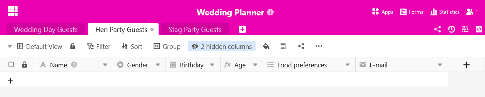
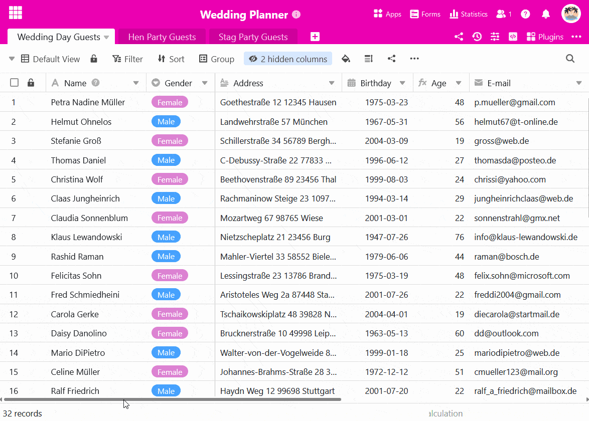
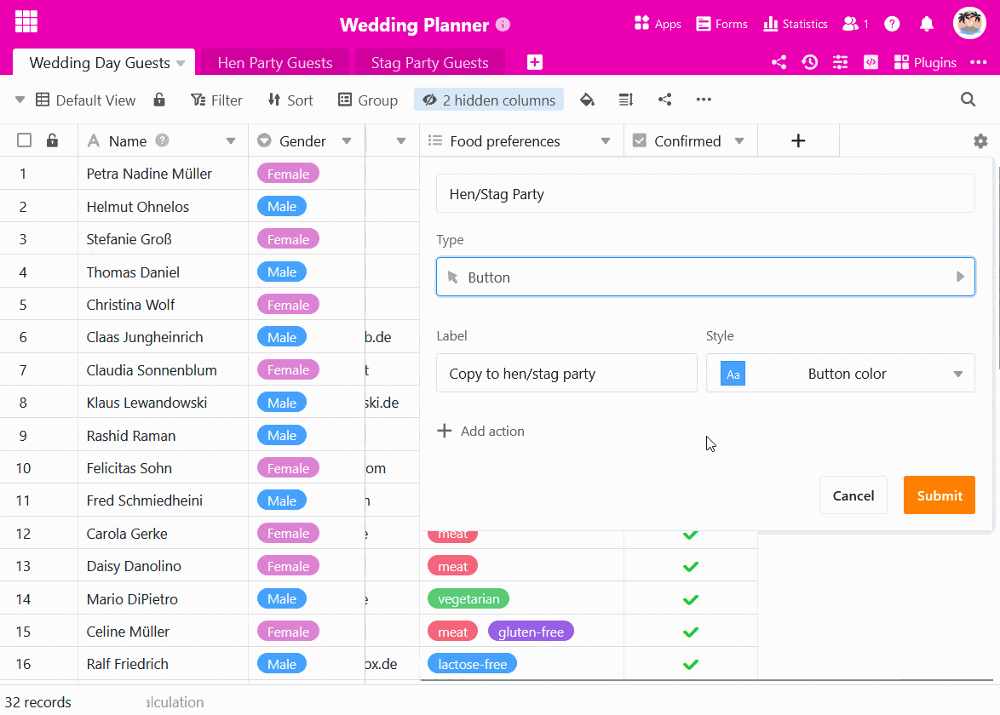
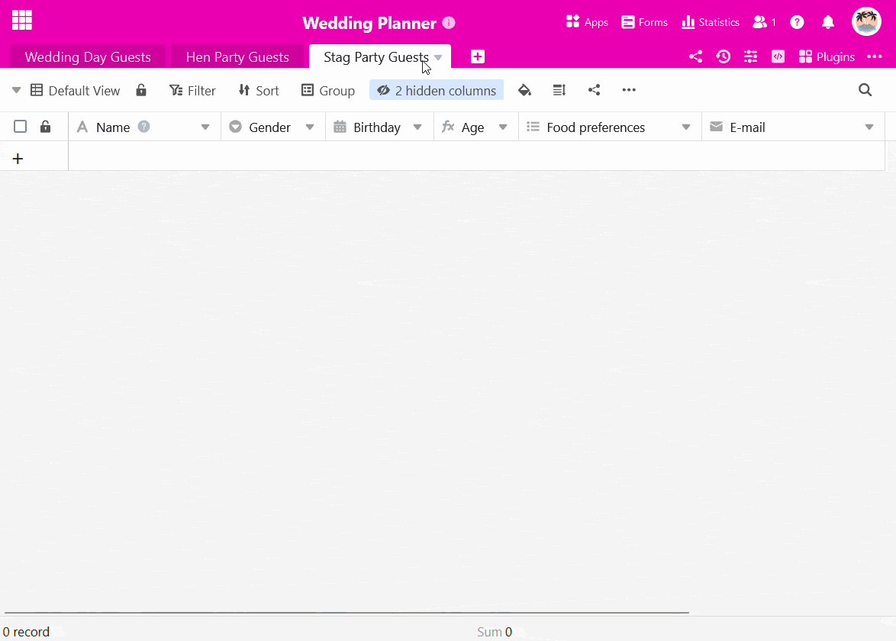

Puede utilizar un **botón** para **copiar filas a otras tablas**. Esto resulta útil si necesita determinados registros de datos en diferentes tablas pero no desea utilizar [un enlace](). Las siguientes instrucciones ilustran el caso de uso utilizando un ejemplo.

## Ejemplo de aplicación

Estás planeando un **banquete de boda** y ya has confeccionado la lista de invitados.

Ahora también quieres organizar la despedida de **soltera** de la novia y la **despedida de soltero** del novio. Por lo tanto, una vez que los invitados hayan confirmado su asistencia, deberás copiar sus datos en dos tablas adicionales, en función del sexo del invitado.

## Crear tablas adecuadas

Cree dos nuevas tablas para las respectivas listas de invitados a la fiesta.



**Consejo:** Un método sencillo para adoptar la estructura de la tabla original es **duplicar la tabla sin las entradas existentes**.

Por supuesto, en las tablas vacías puede eliminar las columnas que no sean necesarias o añadir columnas nuevas más adelante.

## Crear el botón

1. Haga clic en el **símbolo más** grande situado en el extremo derecho de la cabecera de la tabla.
2. Dé un **nombre** a la columna y seleccione _Botón_ como **tipo de columna**.
3. A continuación, defina la **etiqueta** y el **color del botón**.
4. En el siguiente paso, defina el número de **acciones** que se desencadenarán al activar el botón. En nuestro caso, seleccione **Copiar fila a otra tabla**.

6. Seleccione la **tabla** en la que desea copiar las filas.
7. Puede establecer **filtros** para vincular la ejecución de las acciones de los botones a **condiciones**.
8. Confirme la creación del botón con **Enviar**.

## Ejecución condicional de las acciones de los botones

En nuestro ejemplo de aplicación, cuando se pulsa el botón, las invitadas femeninas deben copiarse en la tabla "Invitadas a la despedida de soltera" y los invitados masculinos en la tabla "Invitados a la despedida de soltero". Para ello, cree **dos veces la misma acción**, a la que equipará con **condiciones de filtro** opuestas. Esto le permite copiar los invitados a diferentes mesas en función de su sexo con un solo botón.



## La automatización como opción adicional

Si tiene una suscripción a SeaTable Enterprise, también puede automatizar completamente este paso del proceso. Para ello, configure una [automatización correspondiente con la que podrá añadir entradas en otras tablas](https://seatable.io/es/docs/beispiel-automationen/eintraege-in-andere-tabellen-per-automation-hinzufuegen/).
