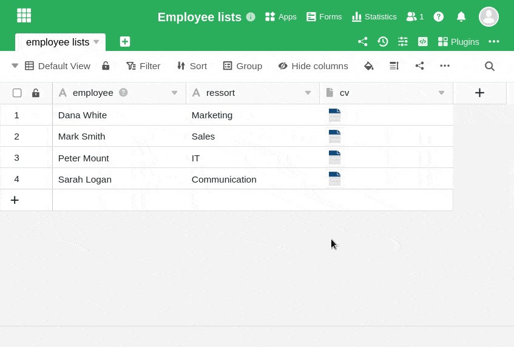
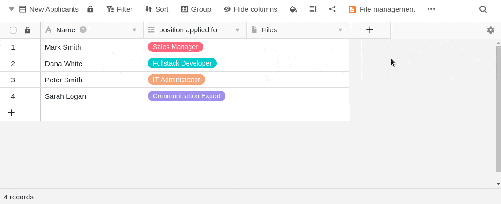

**Файлы** и **изображения**, которые вы удалили из [колонки](https://seatable.io/ru/docs/datei-und-bildanhaenge/die-datei-spalte/) [изображений](https://seatable.io/ru/docs/dateien-und-bilder/die-bild-spalte/) или [файлов](https://seatable.io/ru/docs/datei-und-bildanhaenge/die-datei-spalte/), **не удаляются окончательно**. Эти удаленные файлы остаются в [файловом менеджере](https://seatable.io/ru/docs/dateien-und-bilder/das-dateimanagement-einer-base/) Base и могут быть **восстановлены** двумя различными способами.

## Последняя загрузка

1. Откройте окно **Все файлы** или **Все изображения** **двойным щелчком** по **ячейке** столбца файлов или изображений.
2. Нажмите кнопку **Добавить файлы/изображения** и выберите опцию **Последняя загрузка**.
3. Выберите любой **файл (изображение)** из одной из папок и нажмите на него.
4. Теперь нажмите кнопку **Отправить** в правом нижнем углу, и выбранный файл (изображение) снова будет добавлен в колонку Файл или изображение.

## Управление файлами базы

1. Нажмите на **три точки** в заголовке базы и выберите **Управление файлами**. Вы также можете добавить эту функцию в качестве быстрого доступа на панель инструментов.
2. В открывшемся окне вы найдете **систему папок** со всеми файлами, которые хранятся в вашей базе.
3. Просто перетащите нужный файл (изображение) из файлового менеджера в соответствующую колонку файлов или изображений.

