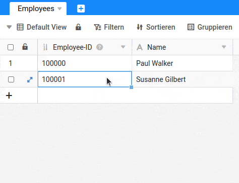
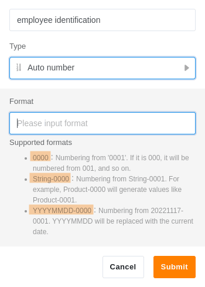

O tipo de coluna **Número Automático** gera um número automaticamente crescente para cada nova linha. Este tipo de coluna é utilizado sempre que se necessita de um identificador único para cada registo.

Note-se que esta coluna **não** se destina a contar o número de registos de uma tabela. Se [eliminar uma fila](), os registos restantes **não** são renumerados. Isto pode levar a **lacunas** na numeração.

Para **renumerar** os seus registos (por exemplo, para eliminar lacunas), pode apagar a coluna _Número Automático_ e recriá-la, ou alterar o tipo de coluna e depois convertê-la novamente para _Número Automático_.

## Estão disponíveis três formatos

Quando se cria a coluna _Número Automático_, determina-se qual o **formato** que os valores nesta coluna devem ter. Pode escolher um **número** com um certo número de dígitos e prefixar este número com uma **cadeia de** letras ou dígitos (por exemplo, a **data** actual).

## Perguntas mais frequentes

Embora o tipo de coluna _Número Automático_ pareça comparativamente simples, existem algumas características especiais que precisam de ser tidas em conta.

Sim. Nas opções de coluna, a coluna oferece a possibilidade de **reiniciar** o **número automático** para um determinado valor, que a linha seguinte recebe então.

Sim, isto pode acontecer. Se se reiniciar o número automático, os valores também podem ocorrer duas vezes. Os valores nesta coluna não são, portanto, únicos.

Sim. Se utilizar uma subscrição Plus ou Enterprise da SeaTable, pode **bloquear** a **coluna para edição**. Desta forma, ninguém pode redefinir o número e cada valor permanece único.


