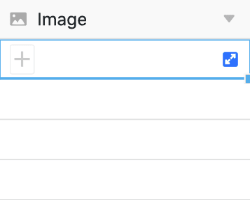

Con la ayuda de una **columna de imágenes**, puedes cargar, guardar y gestionar nuevas imágenes en tus tablas con sólo unos clics.

## Cómo crear una columna de imágenes

1. Haga clic en el **símbolo \[+**\] situado a la derecha de la última columna de la tabla.
2. Dé un **nombre** a la columna en el campo superior.
3. Seleccione el tipo de columna **Imagen** en el menú desplegable.
4. Confirme con **Enviar**.

## Añadir imágenes

En una columna de imágenes, tiene varias opciones para **añadir** imágenes. Así es como funciona:

1. Haga clic en la **celda de** una columna de imágenes.
2. Haz clic en el **símbolo más** que aparece.
3. Se abre una nueva ventana. Aquí puedes subir **imágenes desde tu dispositivo**, incrustarlas mediante **URL** o añadirlas desde el [gestor de archivos]().

### Imágenes locales

En la sección **Imágenes locales**, puedes hacer clic en la casilla con el icono de añadir documentos, seleccionar uno o varios **archivos de imagen de tu dispositivo** y cargarlos en la columna de imágenes.



### Enlace de imagen

En el área **Enlace de** imagen, puede añadir imágenes a la columna de imágenes introduciendo la **URL** de la imagen. Para ello, inserte la URL en el campo libre y haga clic en el **símbolo de enlace** .



### Última carga

En la sección **Subidas** recientes, tiene acceso a la [gestión de archivos]() de la base. Allí se guardan las imágenes que ya ha subido a las columnas de **imágenes** o **archivos** o a **sus propias carpetas**. Seleccione una imagen e insértela en la columna de imágenes haciendo clic en **Enviar**.

### Mediante arrastrar y soltar

También puedes **insertar** imágenes **directamente en una tabla**. Para ello, selecciona cualquier número de **imágenes en tu dispositivo** y arrástralas a la **celda de** una columna de imágenes mientras mantienes pulsado el botón del ratón.

## Vista previa de archivos de imagen

En cuanto inserte un archivo de imagen en la **columna de imágenes**, la imagen cargada se mostrará como una **miniatura reducida**. Puede **ampliar** esta **miniatura** **haciendo doble clic** en la imagen mostrada.

En el **modo de pantalla completa**, puede utilizar las **lupas** para ampliar y reducir las imágenes y las **flechas** para alternar entre varias imágenes en una fila o columna. También puede **borrar** o **descargar** el archivo de imagen mostrado utilizando los iconos  y .

## Gestión de imágenes

Además de subir imágenes, también tienes varias opciones para gestionarlas en una columna de imágenes.

### Descargar imágenes

Puedes **descargar** imágenes almacenadas en una columna de imágenes con sólo unos clics. Para ello, primero **haga doble clic** en una celda que ya contenga imágenes _o_ en el **símbolo azul de la doble flecha**.

A continuación, seleccione la **imagen** deseada y haga clic en el **icono de descarga**  en la imagen.

Si desea descargar **todas las imágenes de una columna**, abra el menú desplegable situado encima de la cabecera de la columna y seleccione **Descargar todo**.

A continuación, puede especificar **su propio nombre de archivo** y se mostrará el **número de archivos** que contiene la exportación.

Si pulsa sobre los **tres puntos**, tiene dos opciones para guardar el archivo: Al **descargarlo**, se guarda en tu dispositivo un archivo zip del que puedes extraer todas las imágenes. También puedes guardar las imágenes **en Seafile**. Para ello, primero debe [conectar una biblioteca Seafile a su Base]().

### Borrar imágenes

También puede **borrar** todas las imágenes almacenadas en una columna de imágenes. Para ello, primero **haga doble clic** en una celda que ya contenga imágenes _o_ en el **símbolo azul de la doble flecha**.

A continuación, seleccione la **imagen** deseada y haga clic en el **símbolo** . Confirme el proceso haciendo clic en **Borrar**.



Las imágenes eliminadas de una columna de imágenes siguen formando parte de Base y, por tanto, **no** se eliminan de forma permanente. Lea los artículos [Acceso a archivos e imágenes eliminados]() y [Cómo eliminar archivos]() de forma permanente.


