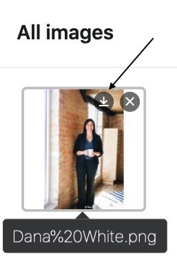

Com a ajuda de uma **coluna de imagens**, pode carregar, guardar e gerir novas imagens nas suas tabelas com apenas alguns cliques.

## Como criar uma coluna de imagens

1. Clique no **símbolo \[+\]** à direita da última coluna da sua tabela.
2. Dê um **nome** à coluna no campo superior.
3. Seleccione o tipo de coluna **Imagem** no menu pendente.
4. Confirmar com **Submeter**.

## Adicionar imagens

Numa coluna de imagens, tem várias opções para **adicionar** imagens. É assim que funciona:

1. Clique na **célula de** uma coluna de imagem.
2. Clique no **símbolo de mais** que aparece.
3. Abre-se uma nova janela. Aqui pode carregar **imagens do seu dispositivo**, incorporá-las através de **URL** ou adicioná-las a partir do [gestor de ficheiros]().

### Imagens locais

Na secção **Imagens locais**, pode clicar na caixa com o ícone de adicionar documentos, selecionar um ou mais **ficheiros de imagem no seu dispositivo** e carregá-los para a coluna de imagens.



### Ligação de imagem

Na área **Ligação de imagem**, pode adicionar imagens à coluna de imagem introduzindo o **URL** da imagem. Para o fazer, insira o URL no campo livre e clique no **símbolo de ligação** .



### Último carregamento

Na secção **Recentemente carregados**, tem acesso à [gestão de ficheiros]() da base. As imagens que já carregou nas **colunas de** **imagens** ou **ficheiros** ou nas **suas próprias pastas** são aí guardadas. Seleccione uma imagem e insira-a na coluna de imagens clicando em **Submeter**.

### Por arrastar e largar

Também pode **inserir** imagens **diretamente numa tabela**. Para tal, seleccione qualquer número de **imagens no seu dispositivo** e arraste-as para a **célula de** uma coluna de imagens, mantendo premido o botão do rato.

## Pré-visualizar ficheiros de imagem

Assim que se insere um ficheiro de imagem na **coluna de imagem**, a imagem carregada é exibida como uma **miniatura reduzida**. Pode **ampliar** esta **miniatura** **fazendo duplo clique sobre** a imagem apresentada.

No **modo de ecrã inteiro**, pode utilizar as **lupas** para ampliar e reduzir as imagens e as **setas** para alternar entre várias imagens numa linha ou coluna. Também pode **apagar** ou **transferir** o ficheiro de imagem apresentado utilizando os ícones  e .

## Gestão de imagens

Para além de carregar imagens, também tem várias opções para gerir as suas imagens numa coluna de imagens.

### Descarregar imagens

Pode **descarregar** imagens armazenadas numa coluna de imagens com apenas alguns cliques. Para tal, comece por fazer **duplo clique** numa célula que já contenha imagens _ou_ no **símbolo de seta dupla azul**.

Em seguida, seleccione a **imagem** pretendida e clique no **ícone de transferência**  na imagem.

Se pretender transferir **todas as imagens de uma coluna**, abra o menu pendente acima do cabeçalho da coluna e seleccione **Transferir tudo**.

Pode então especificar **o seu próprio nome de ficheiro** e será apresentado o **número de ficheiros** contidos na exportação.

Se clicar nos **três pontos**, tem duas opções para guardar o ficheiro: Ao **descarregar**, é guardado um ficheiro zip no seu dispositivo, do qual pode extrair todas as imagens. Também pode **guardar** as imagens **no Seafile**. Para o fazer, tem de [ligar primeiro uma biblioteca Seafile à sua Base]().

### Eliminar imagens

Também é possível **eliminar** todas as imagens armazenadas numa coluna de imagens. Para o fazer, primeiro **faça duplo clique** numa célula que já contenha imagens _ou_ no **símbolo de seta dupla azul**.

Em seguida, seleccione a **imagem** pretendida e clique no **símbolo** . Confirme o processo clicando em **Apagar**.



As imagens excluídas de uma coluna de imagens ainda fazem parte do Base e, portanto, **não são** excluídas permanentemente. Leia os artigos [Aceder a ficheiros e imagens eliminados]() e [Como remover ficheiros permanentemente]().


