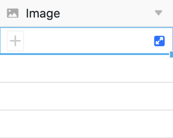

С помощью **колонки изображений** вы можете загружать, сохранять и управлять новыми изображениями в ваших таблицах всего несколькими щелчками мыши.

## Как создать колонку с картинками

1. Нажмите на **символ \[+\]** справа от последнего столбца вашей таблицы.
2. Дайте столбцу **имя** в верхнем поле.
3. Выберите тип столбца **Изображение** из выпадающего меню.
4. Подтвердите с помощью кнопки **Отправить**.

## Добавление изображений

В колонке изображений у вас есть различные варианты **добавления** изображений. Вот как это работает:

1. Щелкните в **ячейке** столбца изображений.
2. Нажмите на появившийся **символ плюса**.
3. Откроется новое окно. Здесь вы можете загрузить **изображения с устройства**, вставить их по **URL** или добавить из [файлового менеджера]().

### Местные изображения

В разделе **Локальные изображения** можно щелкнуть в поле со значком добавления документов, выбрать один или несколько **файлов изображений на своем устройстве** и загрузить их в колонку изображений.



### Ссылка на изображение

В области **Ссылка на изображение** можно добавить изображения в колонку изображений, введя **URL-адрес** изображения. Для этого вставьте URL в свободное поле и нажмите на **символ ссылки** .



### Последняя загрузка

В разделе " **Недавно загруженные"** вы получаете доступ к [управлению файлами]() базы. Здесь сохраняются изображения, которые вы уже загрузили в **колонки** **изображений**, **файлов** или в **собственные папки**. Выберите изображение и вставьте его в колонку изображений, нажав кнопку **Отправить**.

### Через перетаскивание

Вы также можете **вставлять** изображения **непосредственно в таблицу**. Для этого выберите любое количество **изображений на своем устройстве** и перетащите их в **ячейку** столбца изображений, удерживая кнопку мыши.

## Предварительный просмотр файлов изображений

Как только вы вставляете файл изображения в **колонку изображений**, загруженное изображение отображается в виде **уменьшенного эскиза**. Эту **миниатюру** можно **увеличить**, **дважды щелкнув** по отображаемому изображению.

В **полноэкранном режиме** вы можете использовать **лупы** для увеличения и уменьшения изображений, а также **стрелки** для переключения между несколькими изображениями в строке или столбце. Вы также можете **удалить** или **загрузить** отображаемый файл изображения с помощью значков  и .

## Управление имиджем

Помимо загрузки изображений, у вас также есть различные варианты управления изображениями в колонке изображений.

### Загрузить изображения

Вы можете **загрузить** изображения, хранящиеся в столбце изображений, всего несколькими щелчками мыши. Для этого сначала **дважды щелкните** в ячейке, которая уже содержит изображения, _или_ на **синем символе двойной стрелки**.

Затем выберите нужное **изображение** и нажмите на **значок загрузки**  на изображении.

Если вы хотите загрузить **все изображения в колонке**, откройте выпадающее меню над заголовком колонки и выберите **Загрузить все**.

Вы можете задать **собственное имя файла**, и на экране отобразится **количество файлов**, содержащихся в экспортируемом файле.

Если вы нажмете на **три точки**, у вас будет два варианта сохранения файла: При **загрузке** на вашем устройстве сохраняется zip-файл, из которого вы можете извлечь все изображения. Вы также можете сохранить изображения **в Seafile**. Для этого необходимо сначала [подключить библиотеку Seafile к вашей базе]().

### Удаление изображений

Вы также можете **удалить** все изображения, которые хранятся в столбце изображений. Для этого сначала **дважды щелкните** в ячейке, которая уже содержит изображения, _или_ на **синем символе двойной стрелки**.

Затем выберите нужное **изображение** и нажмите на **символ** . Подтвердите процесс, нажав на **Delete**.



Изображения, удаленные из колонки изображений, по-прежнему являются частью Base и, следовательно, **не** удалены безвозвратно. Прочтите статьи [Доступ к удаленным файлам и изображениям]() и [Как удалить файлы навсегда]().


