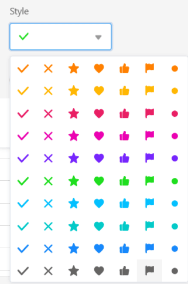

In SeaTable, you have the option of adding **checkbox columns** to your tables. These are ideal for marking tasks as completed, for example - i.e. for an overview of whether rows fulfills a certain **yes/no condition**. You can therefore make excellent use of checkbox columns for [filtering](), [sorting]() or [grouping]().

## Create a checkbox column

1. Click the **\[+\] icon** to the right of the last column of any table.
2. Give the column a **name**.
3. Select **Checkbox** as the column type.
4. Decide whether the [default value]() of the column should be **empty** or **checked**.
5. Confirm with **Submit**.

## Style options of a checkbox column

Don't like the default **green tick**? No problem! You have 70 different style options to fill in your checkboxes the way you want.

