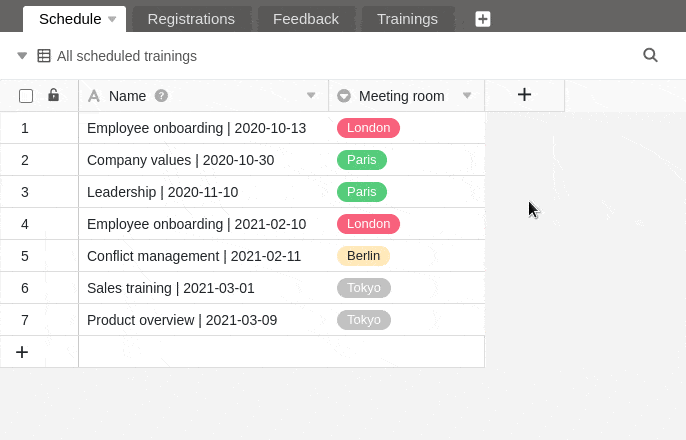
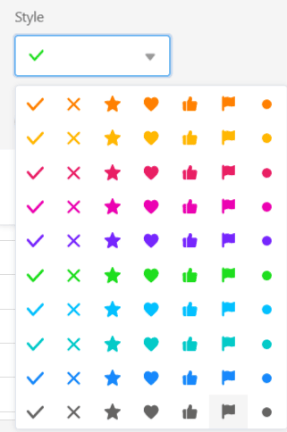

В SeaTable есть возможность добавлять в таблицы **столбцы с флажками**. Они идеально подходят, например, для пометки задач как выполненных - т.е. для обзора выполнения строк по определенному **условию "да/нет"**. Таким образом, столбцы с флажками можно использовать для [фильтрации](), [сортировки]() и [группировки]().

## Создайте колонку с флажком

1. Нажмите на **символ \[+\]** справа от последнего столбца любой таблицы.
2. Дайте колонке **имя**.
3. Выберите **флажок** в качестве типа столбца.
4. Решите, должно ли [значение]() быть **пустым** или **отмеченным галочкой**.
5. Подтвердите с помощью кнопки **Отправить**.

## Параметры стиля колонки с флажком

Не нравится **зеленая галочка** по умолчанию? Не беда! У вас есть 70 вариантов стилей, чтобы заполнить флажки так, как вы хотите.

