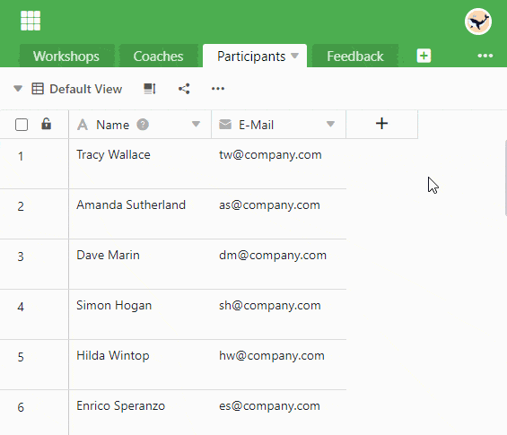
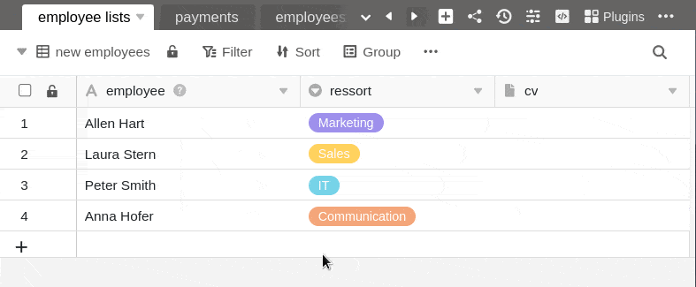
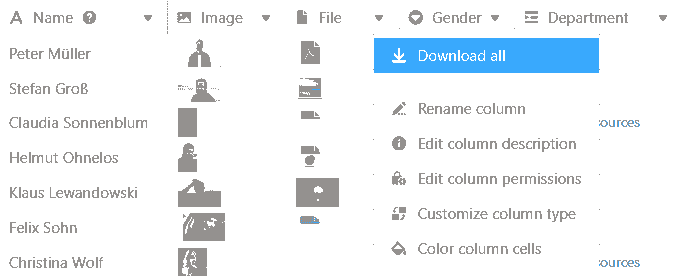
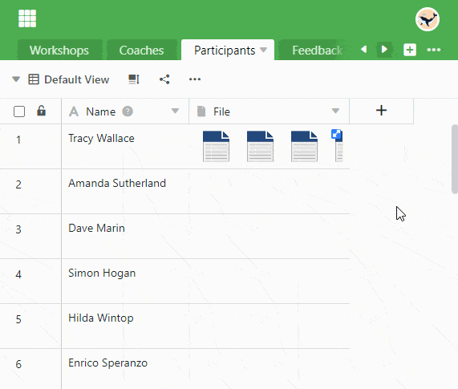
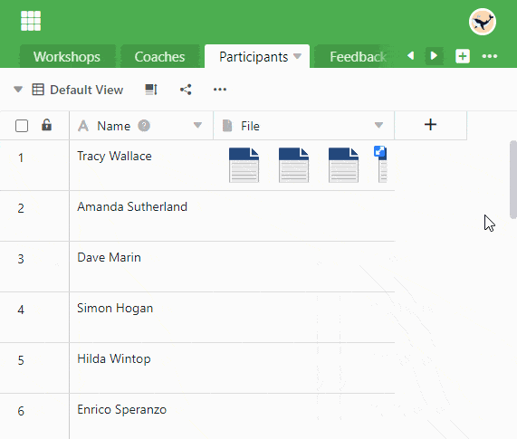

In a **file column** you can save one or more files and thus add documents to the respective row .

## How to create a file column

1. Click the **\[+\] symbol** to the right of the last column in your table.
2. Give the column a **name** in the upper field.
3. Select the **File** column type from the drop-down menu.

## Upload new files

You can **upload files** in the file column by clicking on a **cell** with the mouse and selecting the **plus icon** that appears. In the newly opened window you can **drag and drop** files or click with the mouse to upload files from your device.



### Upload multiple new files at the same time

1. Click in the **cell of** a file column.
2. Click on the **plus icon** that appears.
3. A new window will open. Here you can **drag and drop** or **click to** upload files from your device.
4. Select multiple files at once by selecting all the documents you want to upload and uploading them together.



Files that you upload locally to a file column are saved in a **system folder** that you can access via the [file management]() of your base.



## Adding existing files

Besides new files that you upload locally to the cell of a file column, you can also add existing files, which can come from **three sources**:

- **Last uploaded**: Here you will find the most recently uploaded files saved in the base [file manager]().
- **My folders**: Here you have access to files in your own folders, which you can create and fill in the [file manager]().
- **Seafile**: Here you can select files from [Seafile libraries]() that are attached to your base.

1. Click in the **cell of** a file column and then on the **plus icon** that appeared.
2. A new window will open. In the navigation on the left, select the **source** from which you want to add a file.
3. Click through the **folder structure to** the desired file.
4. Select the **file** and paste it into the cell by clicking **Submit**.

## Download files

1. In the File column, **double-click** the cell that contains the documents you want to download.
2. A new window opens. Here are listed **all the files** that are stored in the cell.
3. So you can create a **single file** download
    - Hover the mouse cursor over the document and click the **download icon** .
4. So you can **Multiple files** download
    - Click **Select.**
    - Select the **Select all** option or put check **marks** in the boxes in front of the files.
    - Then click **Download**.

If you want to download all files in a column, open the drop-down menu above the column header and select **Download all**.

You can then specify **your own file name** and the **number of files** contained in the export will be displayed.

If you click on the **three dots**, you have two options for saving the file: When **downloading**, a zip file is saved on your device from which you can extract all files. You can also save the files **in Seafile**. To do this, you must first [connect a Seafile library to your base]().

## Rename files

1. Open the **All Files** window by **double-clicking** on a cell in the Files column.
2. Hover the mouse cursor over the file you want to rename and click the **three dots**.
3. Select the **Rename** option and enter a new **file name**.

## Delete files

1. Open the **All Files** window by **double-clicking** on a cell in the Files column.
2. So you can create a **single file** Delete
    - Hover the mouse cursor over the file you want to delete and click the **three dots**.
    - Select the **Delete** option.
3. So you can **Multiple files** Delete
    - Click **Select.**
    - Select the **Select all** option or put check **marks** in the boxes in front of the files.
    - Click **Delete**.



The files are **not** permanently deleted in this way. Only when you delete the files in the base [file manager]() are they [permanently removed]().



## Frequently asked questions

Yes. Even if a user has **read-only permission**, he or she can download files.

No. To play **audio files**, you need to download them first.

No, the order **cannot** be changed within a file column. The first uploaded document comes first. By the order in which you upload the documents, you can determine the order within the file column.


