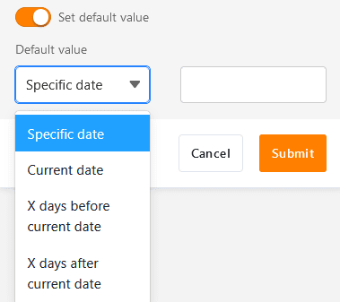
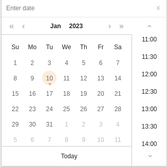
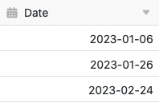

You can use the date column to enter **times** and **dates** in your tables down to the minute. Simply use the displayed calendar or your keyboard to enter a date manually. Please note that SeaTable does not accept any other data inputs in a date column.

## Create a date column

When creating a date column, you can first select a suitable **format** depending on the region and standard.

In addition, you can decide whether you want to raise the date to the **minute** or just the **day**. To do this, activate the slider:

The second slider allows you to set whether a **default value** (for example, a specific date or the current date) should already be entered whenever you create a new row .

Confirm the dialog to create the date column. Afterwards you can select any date from the displayed **calendar** in each row or enter it via your **keyboard**.

**Data collected: accurate to the minute**

**Data collected: day only**

