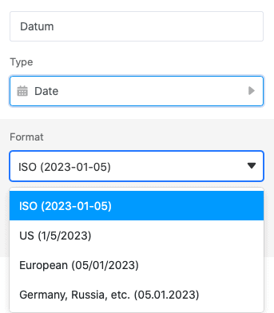
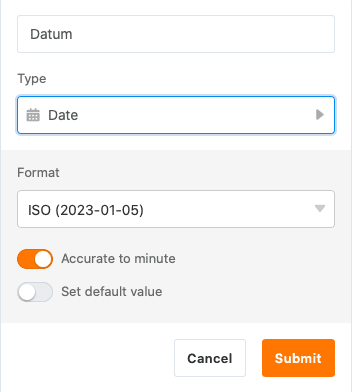
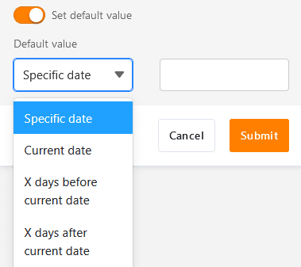
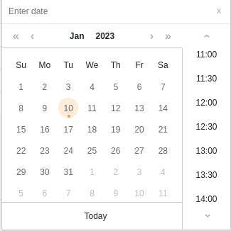
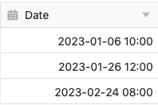
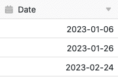

Pode utilizar a coluna de data para introduzir **horas** e **datas** nas suas tabelas até ao minuto. Basta utilizar o calendário que aparece ou o teclado para introduzir uma data manualmente. Tenha em atenção que o SeaTable não aceita quaisquer outras entradas de dados numa coluna de data.

## Criar uma coluna de datas

Ao criar uma coluna de datas, pode primeiro seleccionar um **formato** adequado, dependendo da região e do padrão.

Além disso, pode decidir se quer elevar a data para o **minuto** ou apenas para o **dia**. Para tal, activar o selector:

Com o segundo selector, pode definir se um **valor por defeito** (por exemplo, uma data específica ou a data actual) já deve ser introduzido sempre que criar uma nova linha.

Confirmar o diálogo para criar a coluna de datas. Pode então seleccionar qualquer data em cada linha do **calendário** que aparece ou introduzi-la usando o seu **teclado**.

**Dados recolhidos: exactos ao minuto**

**Dados recolhidos: apenas um dia**

