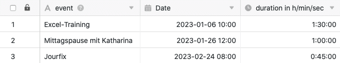
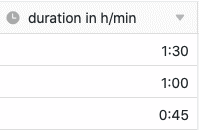
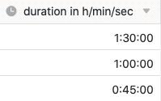

Die **Dauer-Spalte** eignet sich besonders gut, um die Dauer von verschiedenen Ereignissen festzuhalten. Sie kann dabei einen **Zeitraum** auf die Minute oder gar auf die Sekunde genau erfassen. Beispielsweise bietet es sich für die Arbeitszeiterfassung an, die Dauer-Spalte in Verbindung mit einer [Datum-Spalte]() zu nutzen.

## Anlegen der Dauer-Spalte

Beim Anlegen der Dauer-Spalte können Sie entscheiden, ob Sie die Dauer auf die **Minute** oder gar auf die **Sekunde** genau erheben möchten.

### Dauer-Spalte auf die Minute genau

### Dauer-Spalte auf die Sekunde genau

