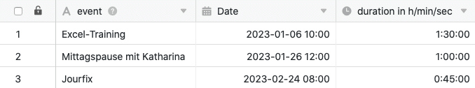

La **colonne de durée** est particulièrement bien adaptée pour enregistrer la durée de différents événements. Elle peut saisir une **période** à la minute ou même à la seconde près. Par exemple, pour la saisie du temps de travail, il est intéressant d'utiliser la colonne de durée en combinaison avec une [colonne de date]().

## Création de la colonne de durée

Lors de la création de la colonne de durée, vous pouvez décider si vous souhaitez relever la durée à la **minute** ou même à la **seconde**.

### Colonne de durée à la minute près

### Colonne de durée à la seconde près

