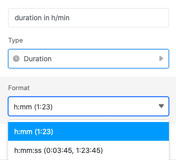

A **coluna da duração** é particularmente adequada para registar a duração de vários eventos. Pode registar um **período de tempo** até ao minuto ou mesmo até ao segundo. Por exemplo, a coluna de duração pode ser usada em conjunto com uma coluna de [datas]() para registar as horas de trabalho.

## Criação da coluna de duração

Ao criar a coluna da duração, pode decidir se quer aumentar a duração para o **minuto** ou mesmo para o **segundo**.

### Coluna de duração até ao minuto

### Coluna de duração até à segunda

