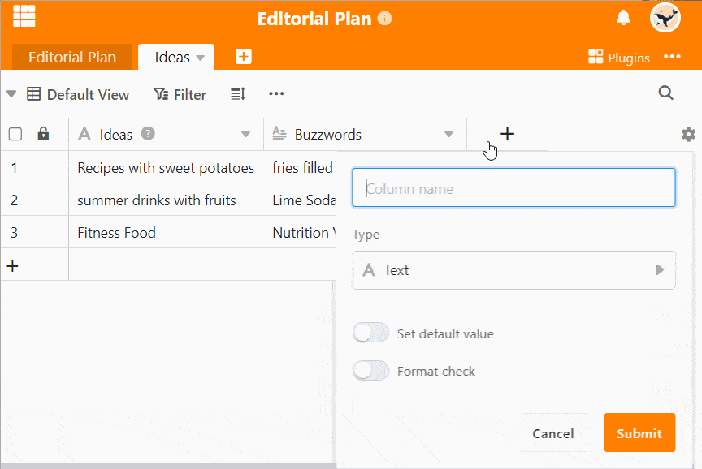

La columna de correo electrónico es un tipo de columna que permite introducir direcciones de correo electrónico. A diferencia de una columna de texto, la columna de correo electrónico garantiza que la entrada tiene la estructura de una dirección de correo electrónico válida.

Además, se muestra un pequeño sobre en cuanto se selecciona una celda de la columna de correo electrónico. Un clic sobre este símbolo abre su programa de correo electrónico para que pueda escribir directamente un e-mail a la dirección seleccionada.

## Uso de la columna de correo electrónico

1. Cree una nueva columna con el tipo de columna **E-mail** mediante el **símbolo más**.
2. Introduzca una **dirección de correo electrónico válida** en una celda de la columna.
3. Haga clic en la celda que contiene la dirección de correo electrónico y aparecerá un **sobre**.
4. Haga clic en el icono para abrir un **nuevo correo electrónico** en su programa de correo electrónico predeterminado.


