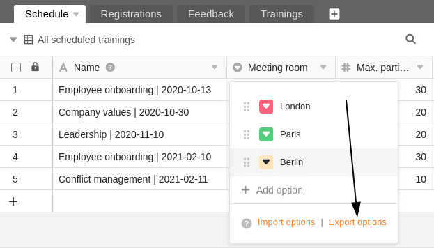

A single select column is ideal if you want to assign **exactly one option** from a list of options to be defined to your rows. The options are given colorful **labels**, which you can use to group your data records into **categories** and clearly arrange tables.

## Creating a single-select column

Creating a single-select column is child's play and can be done with just a few clicks. You can find detailed information under [Add a column]().

1. Click on the **Plus symbol** to the right of the last column of a table.
2. Give the new column a **name**.
3. Select **Single select** as the column type.
4. Confirm with **Submit**.

## Add selection options

In a single select column, you can create various options from which you can then choose when filling the cells. You can add **new options** to the column in several ways:

- Add options via the column settings
- Add options via the cells of the single select column
- Import options


All functions presented in this section apply in the same way to the [multiple select column]().


### Add options via the column settings

1. Click on the **drop-down arrow** to the right of the name of a single-select column.
2. Go to **Edit single select**.
3. Create as many options as you like by clicking on **Add option**.
4. Confirm each entry with **Enter**.
5. If required, you can adjust the **colors** assigned to the options.

### Add options via the cells of the single select column

1. Double-click on a **cell** of the single select column.
2. Enter a suitable term in the **search field** that you would like to define as a **new option**.
3. Click on **Add option**.
4. The term entered is then assigned to the selected cell and added to the various **options** in the column.


If you wish to be able to store **additional data** for each option, you should consider using a [link column]() instead of a single select column. To do this, create the single select as the first column in a separate table. This allows you to enter complete data records for all options, which you can assign to any number of rows in linked tables.


## Export and import options

You can not only **manually enter** the options, but also conveniently **export** them from an existing column and **import** them into another column. This saves you a lot of work if you want to use the same options – even across different bases – for several **single** and **multiple select columns**.

### Export options from a select column

1. Click on the **drop-down arrow** to the right of the name of a single or multiple select column.
2. Select **Edit single select** or **Edit multiple select**.
3. Click on **Export options**.

The options are now **exported** as a JSON file. Depending on your browser settings, the download has either been saved directly to your device or you still need to specify a storage location. In the next step, you can **import** the options into another single or multiple select column.

### Import options into a select column

1. Click on the **drop-down arrow** to the right of the name of a single or multiple select column.
2. Select **Edit single select** or **Edit multiple select**.
3. Click on **Import options**.
4. Select the **JSON file** from your device and confirm the upload.

The options are then **imported** into the selected column and are ready to be filled in the corresponding cells. You can of course continue to add, delete and edit options as you wish.

## Colors of the selection options

To visually design the view within a table, SeaTable assigns a **color** to each option in a single or multiple select column. You can subsequently **adjust** this randomly assigned color via the above-mentioned path to the options.

You open the **color picker** by clicking on the colored **triangle symbol in front of the option name**.

There are currently **24 colors** available to visually highlight the respective options. With an [Enterprise subscription]() you also have the option of creating [custom colors]() for your selection options.

## Change the order of the options

The order of the options is crucial if you want to [sort]() or [group]() by a single select column. SeaTable does **not arrange the options alphabetically**, but flexibly according to the **order of the options**, which you can define as you wish.

1. Click on the **drop-down arrow** to the right of the name of the single select column.
2. Go to **Edit single select**.
3. **Drag and drop** an option to the desired position. To do this, use the grab area with the **six dots** to the left of each option.

## Set default value

For each single select column, you have the option of setting a preset [default value](). The default value is **automatically** assigned to each new row as an option.

1. Click on the **drop-down arrow** to the right of the name of the single select column.
2. Go to **Set default value**.
3. Select the **option** from the list that is to be used as the default value.

If you want to delete the default value again, click on the **trash icon** .

## Cascading a single select column

Using the cascading function, you can define a parent column of the same type for each single select column, which restricts the available options of the subordinate single select column. This offers the following advantages:

- Cascading allows you to **reduce the number of options** available in another single-select column.
- By defining dependencies, you can **create logical relationships** between two single-select columns.
- Especially with a large number of options, this can be very helpful to **minimize mistakes** that can occur when entering data.
- In addition, cascading single select columns can also help to **speed up work processes**.

1. Click on the **drop-down arrow** of a single select column.
2. Click on **Define cascade**.
3. Select a **parent single select column**.
4. Assign any number of **child options** in the current column to the **parent options** of that column.



### Example of a useful cascade

In this example, the table contains data on various education/training units for employees. In addition to the first column, which records various **trainings**, there is already a single-select column that specifies the respective **location** of the training. A **cascade** is defined in this example for a further single-select column, which records the exact **building**.

In this example, the **"Location"** column, which specifies the city in which the respective training takes place, serves as the **parent single select column**. The next step is to assign **subordinate options** from the newly created single select column **"Building"** to the three cities in this column. Specifically, the three options **London**, **Paris** and **Berlin** are assigned the buildings that are located in the respective city.

Which options or buildings can be selected in a cell in the subordinate "Building" column now depends on the city selected in the same row in the "Location" single select column. This allows you to select **only** the buildings that are actually located in the corresponding city.