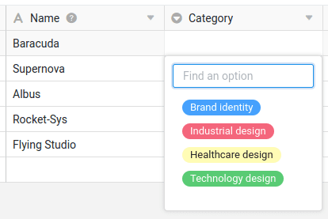
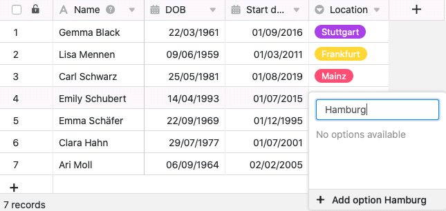
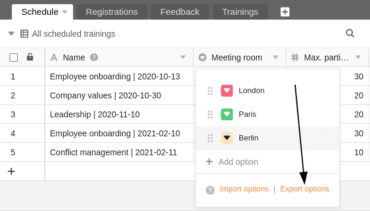
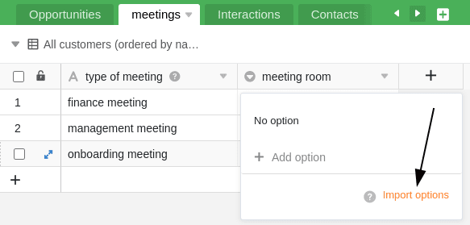
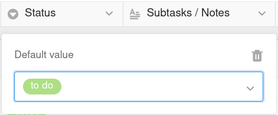
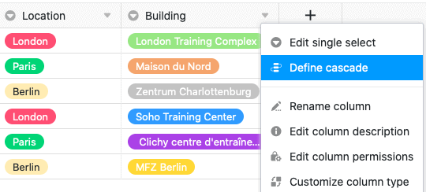
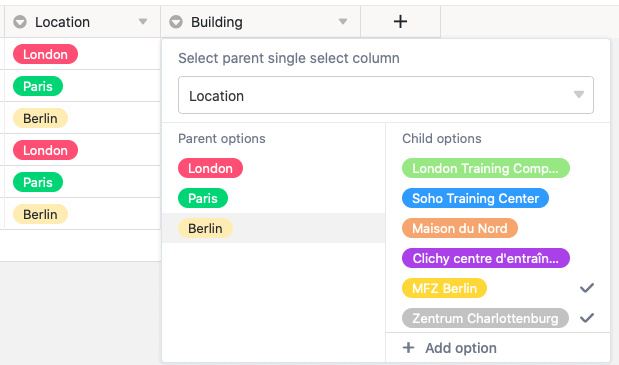

Une colonne de sélection unique est idéale si vous souhaitez attribuer à vos lignes **une seule option** parmi une liste d'options à définir. Les options reçoivent des **étiquettes** colorées qui vous permettent de classer vos enregistrements dans des **catégories** et d'organiser vos tableaux de manière claire.

## Création d'une colonne de sélection unique

La création d'une colonne de sélection unique est un jeu d'enfant et se fait en quelques clics. Pour plus de détails, voir [Ajouter une colonne]().

1. Cliquez sur l'icône **Plus** à droite de la dernière colonne d'un tableau.
2. Donnez un **nom** à la nouvelle colonne.
3. Choisissez **Sélection unique** comme type de colonne.
4. Confirmez en cliquant sur **Envoyer**.

## Ajouter des options de sélection

Dans une colonne de sélection unique, vous pouvez créer diverses options parmi lesquelles vous pourrez choisir lorsque vous remplirez les cellules. **Vous pouvez ajouter de nouvelles options** à la colonne de plusieurs manières :

- Ajouter des options via les paramètres de la colonne
- Ajouter des options à l'aide des cellules de la colonne de sélection unique
- Importer des options


Toutes les fonctions présentées dans cette section s'appliquent de la même manière à la [colonne de sélection multiple]().


### Ajouter des options via les paramètres de colonne

1. Cliquez sur la **flèche déroulante** à droite du nom d'une colonne de sélection unique.
2. Allez sur **Modifier la sélection unique**.
3. Créez autant d'options que vous le souhaitez en cliquant sur **Ajouter une option**.
4. Confirmez chaque entrée en cliquant sur **Enter**.
5. Si nécessaire, vous pouvez personnaliser les **couleurs** attribuées aux options.

### Ajouter des options via les cellules de la colonne de sélection unique

1. Double-cliquez sur une **cellule** de la colonne de sélection unique.
2. Dans le **champ de recherche**, saisissez un terme approprié que vous souhaitez définir comme **nouvelle option**.
3. Cliquez sur **Ajouter une option**.
4. Le terme saisi est ensuite affecté à la cellule sélectionnée et ajouté aux différentes **options de sélection** de la colonne.


Si vous souhaitez pouvoir saisir des **données supplémentaires** pour chaque option de sélection, vous devriez envisager d'utiliser une [colonne de liaison]() plutôt qu'une colonne de sélection unique. Pour ce faire, créez la sélection unique comme première colonne dans un tableau séparé. Vous pouvez ainsi saisir des enregistrements complets pour toutes les options, que vous pouvez associer à autant de lignes que vous le souhaitez dans des tableaux liés.


## Exporter et importer des options

Vous pouvez non seulement **saisir les options manuellement**, mais aussi **exporter** facilement d'une colonne existante et **importer** dans une autre colonne. Cela vous épargne beaucoup de travail si vous voulez utiliser les mêmes options – même sur différentes bases – pour plusieurs **colonnes de sélection unique** et **multiple**.

### Exporter des options depuis une colonne de sélection

1. Cliquez sur la **flèche déroulante** à droite du nom d'une colonne de sélection unique ou multiple.
2. Sélectionnez **Modifier la sélection unique** ou **Modifier la sélection multiple**.
3. Cliquez sur **Exporter les options**.

Les options sont maintenant **exportées** sous forme de fichier JSON. Selon les paramètres de votre navigateur, le téléchargement a été enregistré directement sur votre appareil ou vous devez encore indiquer un emplacement. Dans l'étape suivante, vous pouvez **importer** les options dans une autre colonne de sélection unique ou multiple.

### Importer des options dans une colonne de sélection

1. Cliquez sur la **flèche déroulante** à droite du nom d'une colonne de sélection unique ou multiple.
2. Sélectionnez **Modifier la sélection unique** ou **Modifier la sélection multiple**.
3. Cliquez sur **Importer les options**.
4. Sélectionnez le fichier **JSON** de votre appareil et confirmez le téléchargement.

Les options sont ensuite **importées** dans la colonne sélectionnée et sont prêtes à être remplies dans les cellules correspondantes. Vous pouvez bien sûr continuer à ajouter des options, à les supprimer et à les modifier à votre guise.

## Couleurs des options de sélection

Pour rendre l'affichage plus visuel au sein d'un tableau, SeaTable attribue une **couleur** à chaque option d'une colonne de sélection unique ou multiple. Vous pouvez **personnaliser** cette couleur attribuée aléatoirement en utilisant le chemin d'accès aux options mentionné ci-dessus.

Vous ouvrez le **sélecteur de couleur** en cliquant sur l'icône **triangle colorée devant le nom de l'option**.

Actuellement, vous disposez de **24 couleurs** pour mettre en évidence visuellement les options respectives. Avec un [abonnement Enterprise](), vous avez également la possibilité de créer des [couleurs personnalisées]() pour vos options de sélection.

## Changer l'ordre des options

L'ordre des options est essentiel si vous souhaitez [trier]() ou [grouper]() après une colonne de sélection unique. En effet, SeaTable **n'organise pas les options par ordre alphabétique**, mais s'adapte de manière flexible à **l'ordre des options** que vous pouvez définir comme vous le souhaitez.

1. Cliquez sur la **flèche déroulante** à droite du nom de la colonne de sélection unique.
2. Allez sur **Modifier une sélection unique**.
3. **Déposez** une option à l'endroit souhaité par **glisser-déposer**. Utilisez pour cela la zone de préhension avec les **six points** qui se trouve à gauche de chaque option.

## Définir la valeur par défaut

Pour chaque colonne de sélection unique, vous avez la possibilité de définir une [valeur par défaut](). La valeur par défaut est attribuée **automatiquement** comme option à chaque nouvelle ligne.

1. Cliquez sur la **flèche déroulante** à droite du nom de la colonne de sélection unique.
2. Allez sur **Définir la valeur par défaut**.
3. Sélectionnez dans la liste la **option** à utiliser comme valeur par défaut.

Si vous souhaitez supprimer la valeur par défaut, cliquez sur l'icône **Corbeille** .

## Mise en cascade d'une sélection unique

La fonction de mise en cascade vous permet de définir, pour chaque colonne de sélection unique, une colonne parente du même type qui limite les options disponibles de la colonne de sélection unique subordonnée. Cela présente les avantages suivants :

- En utilisant la mise en cascade, vous pouvez **réduire le nombre d'options** disponibles dans une autre colonne de sélection unique.
- En définissant des dépendances, vous pouvez **créer des relations logiques** entre deux colonnes à choix unique.
- Cela peut être très utile, en particulier si vous avez un grand nombre d'options, pour **réduire les erreurs** qui peuvent survenir lors de la saisie des données.
- En outre, la mise en cascade de colonnes de sélection unique peut également aider à **accélérer les processus de travail**.

1. Cliquez sur la **flèche déroulante** d'une colonne de sélection unique.
2. Cliquez sur **Définir la mise en cascade**.
3. Sélectionnez une **colonne de sélection unique** qui servira de colonne parente.
4. Attribuez aux **options parentes** de cette colonne autant de **options subordonnées** que vous le souhaitez dans la colonne actuelle.



### Exemple de cascadage

Dans cet exemple, le tableau contient des données sur les différentes sessions de formation des employés. En plus de la première colonne qui répertorie les différentes **formations**, il existe déjà une colonne de sélection unique qui indique le **lieu** de la formation. Dans cet exemple, une **cascade** est définie pour une autre colonne de sélection unique qui saisit le **bâtiment** exact.

Dans cet exemple, la colonne **"Location "**, qui indique la ville où se déroule la formation, sert de **colonne de sélection unique supérieure**. L'étape suivante consiste à attribuer des **options subordonnées** aux trois villes de cette colonne à partir de la colonne de sélection unique **"Building "** nouvellement créée. Concrètement, les trois options **Londres**, **Paris** et **Berlin** sont affectées aux bâtiments qui se trouvent dans chaque ville.

Les options ou les bâtiments qui peuvent être sélectionnés dans une cellule de la colonne subordonnée "Building" dépendent maintenant de la ville sélectionnée sur la même ligne dans la colonne de sélection unique "Location". Cela vous permet de sélectionner **exclusivement** les bâtiments qui se trouvent réellement dans la ville en question.