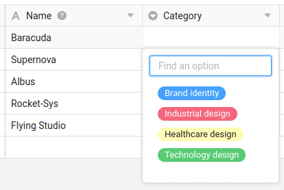
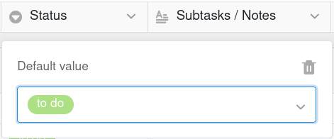
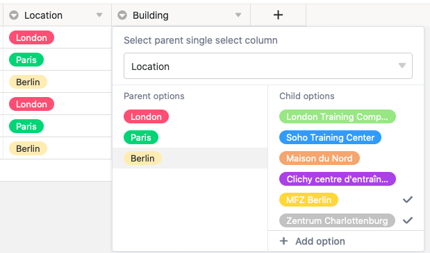

Uma coluna de seleção única é ideal se pretender atribuir **exatamente uma opção** de uma lista de opções a definir às suas linhas. As opções recebem **rótulos** coloridos com os quais pode classificar os seus registos de dados em **categorias** e organizar as tabelas de forma clara.

## Criar uma coluna de seleção única

Criar uma coluna de seleção única é uma brincadeira de crianças e pode ser feito com apenas alguns cliques. Pode encontrar informações detalhadas em [Adicionar uma coluna]().

1. Clique no símbolo **Mais** à direita da última coluna de uma tabela.
2. Atribua um **nome** à nova coluna.
3. Selecione **Seleção única** como o tipo de coluna.
4. Confirme com **Enviar**.

## Adicione opções de seleção

Pode criar várias opções numa coluna de seleção única, a partir das quais pode escolher quando preencher as células. Pode adicionar **novas opções** à coluna de várias formas:

- Adicione opções através das definições da coluna
- Adicione opções através das células da coluna de seleção única
- Importe opções


Todas as funções apresentadas nesta secção aplicam-se da mesma forma à [coluna de seleção múltipla]().


### Adicione opções através das definições da coluna

1. Clique na **seta pendente** à direita do nome de uma coluna de seleção única.
2. Vá para **Editar seleção única**.
3. Crie todas as opções que desejar, clicando em **Adicionar opção**.
4. Confirme cada entrada com o botão **Enter**.
5. Se necessário, pode ajustar as **cores** atribuídas às opções.

### Adicione opções através das células da coluna de seleção única

1. Faça duplo clique numa **célula** da coluna de seleção única.
2. Introduza um termo adequado no **campo de pesquisa** que gostaria de definir como uma **nova opção**.
3. Clique em **Adicionar opção**.
4. O termo introduzido é então atribuído à célula selecionada e adicionado às várias **opções de seleção** da coluna.


Se pretender armazenar **dados adicionais** para cada opção de seleção, deve considerar a utilização de uma [coluna de ligação]() em vez de uma coluna de seleção única. Para tal, crie a seleção única como a primeira coluna de uma tabela separada. Isto permite-lhe introduzir registos de dados completos para todas as opções, que pode atribuir a qualquer número de linhas em tabelas ligadas.


## Exportar e importar opções

Pode não só **introduzir manualmente** as opções, mas também **exportá-las** de uma coluna existente e **importá-las** para outra coluna. Isto poupa-lhe muito trabalho se quiser utilizar as mesmas opções – mesmo em bases diferentes – para várias **colunas de seleção única** e **múltipla**.

### Exportar opções de uma coluna de seleção

1. Clique na **seta pendente** à direita do nome de uma coluna de seleção única ou múltipla.
2. Selecione **Editar seleção única** ou **Editar seleção múltipla**.
3. Clique em **Opções de exportação**.

As opções são agora **exportadas** como um ficheiro JSON. Dependendo das definições do seu browser, a transferência foi guardada diretamente no seu dispositivo ou terá ainda de especificar uma localização de armazenamento. No passo seguinte, pode **importar** as opções para outra coluna de seleção única ou múltipla.

### Importar opções para uma coluna de seleção

1. Clique na **seta pendente** à direita do nome de uma coluna de seleção única ou múltipla.
2. Selecione **Editar seleção única** ou **Editar seleção múltipla**.
3. Clique em **Opções de importação**.
4. Selecione o ficheiro **JSON** do seu dispositivo e confirme o carregamento.

As opções são então **importadas** para a coluna selecionada e estão prontas para serem preenchidas nas células correspondentes. Pode, naturalmente, continuar a adicionar, eliminar e editar opções como desejar.

## Cores das opções de seleção

Para desenhar visualmente a vista dentro de uma tabela, o SeaTable atribui uma **cor** a cada opção numa coluna de seleção única ou de seleção múltipla. Pode posteriormente **ajustar** esta cor atribuída aleatoriamente através do caminho acima mencionado para as opções.

Para abrir o **selecionador de cores**, clique no símbolo do **triângulo colorido em frente do nome da opção**.

Existem atualmente **24 cores** disponíveis para realçar visualmente as respectivas opções. Com uma [subscrição Enterprise]() também tem a opção de criar [cores personalizadas]() para as suas opções de seleção.

## Altere a ordem das opções

A ordem das opções é crucial se quiser [ordenar]() ou [agrupar]() por uma única coluna de seleção. O SeaTable **não organiza as opções por ordem alfabética**, mas sim de forma flexível de acordo com a **ordem das opções**, que pode definir como desejar.

1. Clique na **seta pendente** à direita do nome da coluna de seleção única.
2. Vá para **Editar seleção única**.
3. **Arraste e solte** uma opção para a posição desejada. Para o fazer, utilize os **seis pontos** à esquerda, em frente de cada opção.

## Defina o valor padrão

Para cada coluna de seleção única, tem a opção de definir um [valor padrão](). O valor por defeito é **automaticamente** atribuído a cada nova linha como uma opção.

1. Clique na **seta pendente** à direita do nome da coluna de seleção única.
2. Vá para **Defina o valor padrão**.
3. Na lista, selecione a **opção** que deve ser utilizada como valor predefinido.

Se pretender eliminar novamente o valor predefinido, clique no ícone do **Caixote do lixo** .

## Colocar em cascata uma seleção única 

Utilizando a função em cascata, pode definir uma coluna principal do mesmo tipo para cada coluna de seleção única, que restringe as opções disponíveis da coluna de seleção única subordinada. Isto oferece-lhe as seguintes vantagens:

- O cascateamento permite-lhe **reduzir o número de opções** disponíveis noutra coluna de seleção única.
- Ao definir dependências, pode **criar relações lógicas** entre duas colunas de seleção única.
- Especialmente com um grande número de opções, isto pode ser muito útil para **minimizar erros** que podem ocorrer ao introduzir dados.
- Além disso, as colunas de seleção única em cascata também podem ajudar a **acelerar os processos de trabalho**.

1. Clique na **seta pendente** de uma coluna de seleção única.
2. Clique em **Definir cascata**.
3. Selecione uma **coluna de seleção única** que funcione como coluna principal.
4. Atribua qualquer número de **opções subordinadas na coluna atual** às **opções pai** desta coluna.



### Exemplo de cascata

Neste exemplo, a tabela contém dados sobre várias unidades de educação/formação contínua para funcionários. Para além da primeira coluna, que regista várias **formações**, já existe uma coluna de seleção única que especifica a respectiva **localização** da formação. Neste exemplo, é definido um **cascading** para uma outra coluna de seleção única, que regista o **edifício** exato.

Neste exemplo, a coluna **"Location"**, que especifica a cidade em que a respectiva formação tem lugar, serve como **coluna de seleção individual pai**. O passo seguinte é atribuir **opções subordinadas** da recém-criada coluna de seleção única **"Building"** às três cidades desta coluna. Especificamente, as três opções **Londres**, **Paris** e **Berlim** são atribuídas aos edifícios que estão localizados na respectiva cidade.

As opções ou edifícios que podem ser selecionados numa célula da coluna subordinada "Building" dependem agora da cidade selecionada na mesma linha na coluna de seleção única "Location". Isto permite-lhe selecionar **apenas** os edifícios que estão realmente localizados na cidade correspondente.