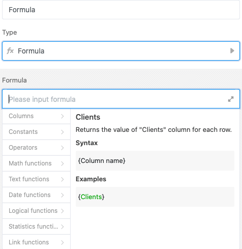
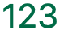

O SeaTable oferece-lhe muitas funções diferentes que pode adicionar à sua tabela. Uma delas é a chamada **coluna de fórmulas**. Com a ajuda das fórmulas, pode ligar valores de diferentes colunas e criar diferentes funções com base nos tipos de dados dessas colunas. Entre outras coisas, pode calcular com valores numa linha, fundi-los ou relacioná-los entre si.



## Criar uma coluna de fórmulas

Para aplicar uma fórmula, deve primeiro adicionar uma nova coluna de fórmula à sua tabela. Pode saber como o fazer [aqui]().

O SeaTable fornece-lhe um **editor de** fórmulas para o ajudar a introduzir fórmulas.

## Escreva uma primeira fórmula

Quando a coluna de fórmulas estiver criada, pode começar a escrever a fórmula. A ilustração seguinte mostra uma fórmula simples para calcular a média de cinco números.

Esta fórmula escreve sempre o valor estático _13,2_ na coluna de fórmula como resultado. No entanto, a verdadeira força da coluna de fórmulas só se manifesta quando utiliza os valores de outras colunas para a sua fórmula. Com o **{nome da coluna}** entre parênteses rectos, pode fazer referência a colunas existentes na sua tabela.



Pode então inserir certas **constantes**, **operandos** e **funções** na sua fórmula para calcular, fundir ou relacionar os valores das diferentes colunas.

## Linguagem de cor clara

Para poder distinguir os diferentes elementos da sua fórmula, estes são marcados com uma **cor** diferente consoante o seu tipo:

| Objecto                 | Exemplo                                                                                                         |
| ----------------------- | --------------------------------------------------------------------------------------------------------------- |
| Funções                 |                               |
| Texto / Corda           |           |
| Números                 |                        |
| Referências das colunas |  |



## Exemplos de fórmulas

Seguem-se alguns exemplos que ilustram a utilidade e a utilização de fórmulas.

- [Exemplo de fórmula: Multiplicação simples com uma fórmula]()
- [Exemplo de fórmula: Fórmula de fusão de colunas de texto com a ajuda de uma fórmula]()
- [Exemplo de fórmula: Lógico se operadores para comparar valores]()
- [Exemplo de fórmula: Calcular a duração de umas férias]()
- [Exemplo de fórmula: Calcular dias para um evento]()
- [Exemplo de fórmula: Procura de uma palavra num texto]()

## As convenções matemáticas também se aplicam em SeaTable

Evidentemente, pode confiar no facto de que as convenções matemáticas também são aplicadas nas fórmulas de SeaTable. Aqui estão os exemplos mais importantes:

- Pode **aninhar funções** umas dentro das outras com parênteses. Exemplo: (( 1 + 2 ) \* 3)
- **O ponto antes do traço**, a **ordem dos parêntesis** e outras **regras matemáticas** são tidas em conta no SeaTable.

## Formatação da coluna de fórmulas

Pode formatar os resultados na coluna da fórmula. Cada fórmula no SeaTable tem como resultado um **número**, uma **data** ou um **texto/corda**. Dependendo disso, estão disponíveis diferentes **definições de formato**.

