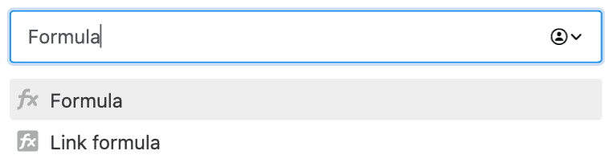

SeaTable предлагает множество различных функций, которые можно добавить в таблицу. Одной из них является так называемый **столбец формул**. С помощью формул можно связывать значения из разных столбцов и создавать различные функции на основе типов данных этих столбцов. В частности, можно производить вычисления со значениями в строке, объединять их или связывать друг с другом.



## Создание столбца формул

Чтобы применить формулу, необходимо сначала добавить в таблицу новый столбец формул. Как это сделать, можно узнать [здесь]().

SeaTable предоставляет **редактор формул** для ввода формул.

## Напишите первую формулу

После создания столбца формул можно приступать к написанию формулы. На следующем рисунке показана простая формула для вычисления среднего значения пяти чисел.

Эта формула всегда записывает в столбец формул статическое значение _13,2_ в качестве результата. Однако по-настоящему сильные стороны столбца формул проявляются только тогда, когда в формуле используются значения других столбцов. С помощью **{имя столбца}** в фигурных скобках можно ссылаться на существующие столбцы в таблице.



Затем в формулу можно вставить определенные **константы**, **операнды** и **функции** для вычисления, объединения или взаимосвязи значений различных столбцов.

## Понятный язык цвета

Для того чтобы можно было отличить друг от друга различные элементы формулы, они обозначены разным **цветом** в зависимости от их типа:

| Объект            | Пример                                                                                                      |
| ----------------- | ----------------------------------------------------------------------------------------------------------- |
| Функции           |                             |
| Текст / Строка    |              |
| Номера            |                      |
| Ссылки на колонки |  |



## Примеры формул

Ниже приведено несколько примеров, иллюстрирующих полезность и использование формул.

- [Пример формулы: Простое умножение с помощью формулы]()
- [Пример формулы: объединение текстовых колонок с помощью формулы]()
- [Пример формулы: Логические операторы if для сравнения значений]()
- [Пример формулы: Рассчитать продолжительность отпуска]()
- [Пример формулы: Расчет дней до события]()
- [Пример формулы: Поиск слова в тексте]()

## Математические соглашения также применяются в SeaTable

Конечно, вы можете рассчитывать на то, что в формулах SeaTable также применяются математические условности. Вот наиболее важные примеры:

- **Функции** можно **вложить** друг в друга с помощью скобок. Пример: (( 1 + 2 ) \* 3)
- **Точка перед тире**, **порядок скобок** и другие **математические правила** учитываются в SeaTable.

## Форматирование столбца формул

Результаты можно отформатировать в колонке формул. Каждая формула в SeaTable имеет в качестве результата **число**, **дату** или **текст/строку**. В зависимости от этого возможны различные **настройки форматирования**.

