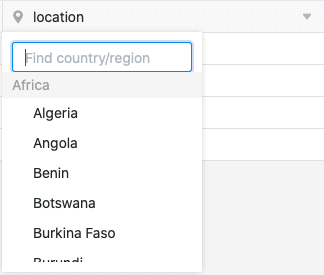
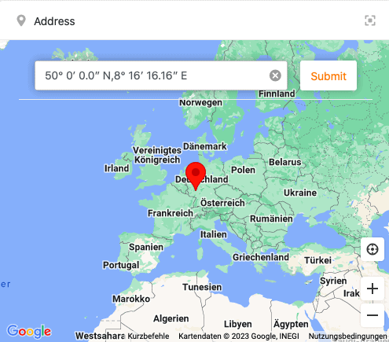

Mithilfe der Geopositions-Spalte können Sie die Längen- und Breitengrade eines beliebigen Standorts in Ihren Tabellen erheben. Zusätzlich haben Sie die Möglichkeit, ein Land bzw. eine Region mithilfe der Suchfunktion zu finden und als Eintrag hinzuzufügen.

## Die Geopositions-Spalte

Beim Anlegen einer Geopositions-Spalte können Sie entscheiden, ob Sie Ihrer Tabelle die **Längen- und Breitengrade** eines Standorts oder ein **Land** bzw. eine **Region** mithilfe der Suchfunktion hinzufügen möchten.

## Erhebung von Ländern und Regionen

Bei dieser Option können Sie in jeder Zelle der Spalte ein **Land** aus einer festgelegten Liste auswählen. Ein **Eingabefeld** mit Autovervollständigung hilft Ihnen bei der Suche nach dem gewünschten Land. Andere Werte werden von der Spalte **nicht** akzeptiert.

## Erhebung von Längen- und Breitengraden eines beliebigen Standorts

Wenn Sie sich für die Option der Längen- und Breitengrade entscheiden, präsentiert SeaTable einen **Kartenausschnitt** und ein **Eingabefeld**. Sie können entweder den gewünschten **Ort** auf der Karte markieren oder im Eingabefeld den **Längen- und Breitengrad** eingeben.

