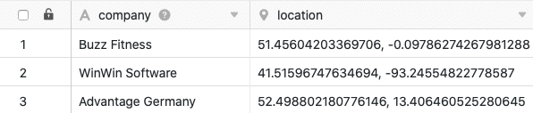

La colonne de géolocalisation vous permet de collecter la latitude et la longitude de n'importe quel lieu dans vos tableaux. De plus, vous avez la possibilité de trouver un pays ou une région à l'aide de la fonction de recherche et de l'ajouter comme entrée.

## La colonne de géolocalisation

Lorsque vous créez une colonne de géolocalisation, vous pouvez décider d'ajouter à votre tableau **la latitude et la long** itude d'un lieu ou un **pays** ou une **région** à l'aide de la fonction de recherche.

## Enquête sur les pays et les régions

Cette option vous permet de sélectionner un **pays** dans une liste prédéfinie dans chaque cellule de la colonne. Un **champ de saisie** avec autocomplétion vous aide à trouver le pays souhaité. Les autres valeurs ne sont **pas** acceptées par la colonne.

## Relevé de la latitude et de la longitude de n'importe quel lieu

Si vous choisissez l'option de latitude et de longitude, SeaTable présente une **section de la carte** et un **champ de saisie**. Vous pouvez soit sélectionner le **lieu** souhaité sur la carte, soit saisir la latitude **et la long** itude dans le champ de saisie.

