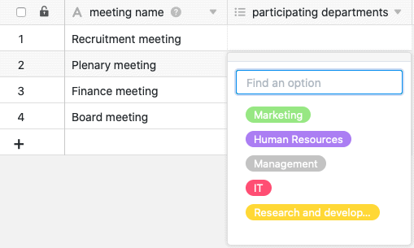

Eine Mehrfachauswahl-Spalte ist ideal, wenn Sie Ihren Zeilen in einer Spalte **mehrere Optionen** aus einer zu definierenden Liste von Optionen zuweisen möchten. Die Optionen erhalten bunte Labels, mit denen Sie Ihre Datensätze versehen und Tabellen übersichtlich gestalten können, z. B. indem Sie nach bestimmten Optionen [filtern]().

## Anlegen einer Mehrfachauswahl-Spalte

Das Anlegen einer Mehrfachauswahl-Spalte ist kinderleicht und mit wenigen Klicks erledigt. Ausführliche Informationen finden Sie unter [Hinzufügen einer Spalte]().

1. Klicken Sie auf das **\[+\]-Symbol** rechts neben der letzten Spalte einer beliebigen Tabelle.
2. Geben Sie der neuen Spalte einen **Namen**.
3. Wählen Sie als Spaltentyp **Mehrfachauswahl**.
4. Bestätigen Sie mit **Abschicken**.

## Gemeinsamkeiten mit der Einfachauswahl-Spalte

### Mehrfachauswahl-Optionen hinzufügen

Das Hinzufügen von Optionen zu einer Mehrfachauswahl-Spalte funktioniert **genauso wie bei einer Einfachauswahl-Spalte**. Neue Optionen können Sie dabei auf mehreren Wegen hinzufügen. Erfahren Sie alles darüber im Artikel [zur Einfachauswahl-Spalte]().

### Mehrfachauswahl-Optionen exportieren und importieren

Sie können die Optionen einer Mehrfachauswahl-Spalte wie bei einer Einfachauswahl-Spalte **exportieren** und **importieren**. Nähere Informationen dazu finden Sie im Artikel zur Einfachauswahl-Spalte.

### Farben der Optionen

Aktuell stehen Ihnen wie bei der Einfachauswahl-Spalte **24 Farben** zur Verfügung, um die jeweiligen Optionen visuell hervorzuheben.

Mit einem [Enterprise-Abo]() haben Sie zudem die Möglichkeit, [eigene Farben]() für Ihre Mehrfachauswahl-Optionen anzulegen.

### Ändern der Reihenfolge von Mehrfachauswahl-Optionen

Die Reihenfolge der Optionen lässt sich genauso wie bei einer Einfachauswahl-Spalte anpassen. Sie ist von entscheidender Bedeutung, wenn Sie nach der Mehrfachauswahl-Spalte [sortieren]() oder [gruppieren]() möchten. Denn SeaTable ordnet die Optionen **nicht alphabetisch**, sondern richtet sich flexibel nach der **Reihenfolge der Optionen**, die Sie per Drag-and-Drop festlegen.

### Standardwert festlegen

Bei einer Mehrfachauswahl-Spalte haben Sie im Gegensatz zur Einfachauswahl-Spalte **nicht** die Möglichkeit, einen Standardwert festzulegen.

## Mehrfachauswahl oder Verknüpfung zu anderen Einträgen?

Wenn Sie sich wünschen, **zusätzliche Informationen** zu jeder Auswahloption speichern zu können, sollten Sie in Erwägung ziehen, statt einer Mehrfachauswahl-Spalte eine [Verknüpfungsspalte]() zu verwenden. Dazu legen Sie in einer separaten Tabelle für alle Optionen vollständige Datensätze an, die Sie mit beliebig vielen Zeilen in anderen Tabellen verknüpfen können.
