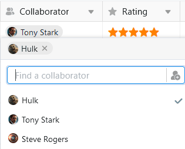

In the **collaborator column**, you can assign one or more **people** to row . SeaTable allows you to select people who currently have **access** to the **base** as well as all other team members without access.

## Select persons with access to the base

If you **double-click** in a cell of an collaborator column, a list appears with all users who currently have access to the base. Select one or more of these **people**. You can also use the **search field** to find a specific user.



## Select team members without access to the base

If you cannot find a user via the search field in the collaborator column, they do **not** currently have **access** to the base. However, if they are a **member of your team**, you can still enter them in the collaborator column.

Click on the  icon to add team members without access. Enter the name of the user in the **search field**, select the desired **team member** and confirm with **Add**.

## Notification of the collaborator when adding

When creating an collaborator column, you can **activate** the **slider** so that collaborators receive a [notification]() when others enter them in the column and thus assign them to row .

Collaborators then receive a corresponding notification in base, which they can access via the  **bell symbol** in the top right-hand corner.

## Set default value

You can set one or more collaborators as the [default value]() in an collaborator column. You can choose between the options **Current user** or **Specific users**. Whenever someone adds a new row to the table, either the creator of the row or the selected persons are automatically entered in the collaborator column.

## Select collaborators as recipients of automated notifications

When sending notifications via [automations](), you can select all persons entered in the collaborator column as recipients of the message.

## The collaborator column in universal apps

The collaborator column is also an advantage in the [Universal app](). You can activate the option for team members to be visible to all users in the drop-down list in the app [settings]().

If you do not want the app users to be able to see the data records of other users, define **preset filters**: If a page is filtered by collaborator column with the condition "includes current user", each user of the universal app only sees the entries that are assigned to them in the table.

