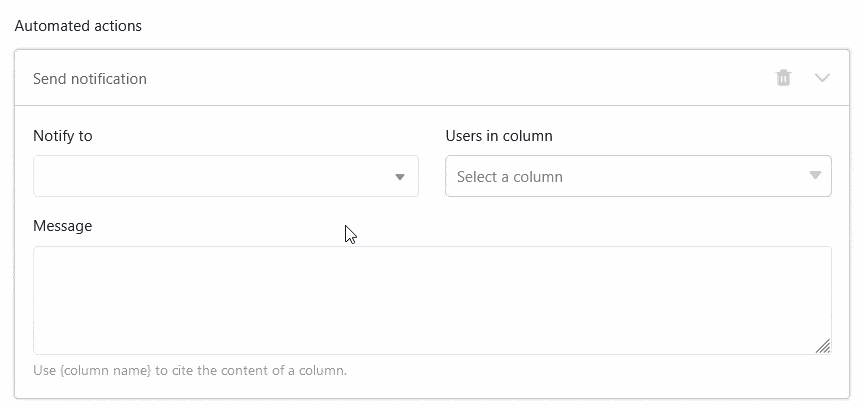

Na **coluna do colaborador**, pode atribuir uma ou mais **pessoas** a uma linha. O SeaTable permite-lhe selecionar as pessoas que têm atualmente **acesso** à **base**, bem como todos os outros membros da equipa sem acesso.

## Selecionar as pessoas com acesso à base

Se fizer **duplo clique** numa célula de uma coluna de colaboradores, aparece uma lista com todos os utilizadores que têm atualmente acesso à base. Seleccione uma ou mais destas **pessoas**. Também é possível utilizar o **campo de pesquisa** para encontrar um utilizador específico.



## Selecionar membros da equipa sem acesso à base

Se não conseguir encontrar um utilizador através do campo de pesquisa na coluna do colaborador, ele **não** tem atualmente **acesso** à base. No entanto, se for um **membro da sua equipa**, pode introduzi-lo na coluna do colaborador.

Clique no ícone  para adicionar membros da equipa sem acesso. Introduza o nome do utilizador no **campo de pesquisa**, seleccione o **membro da equipa** pretendido e confirme com **Adicionar**.

## Notificação do trabalhador ao acrescentar

Ao criar uma coluna de colaboradores, é possível **ativar** a **barra deslizante** para que os colaboradores recebam uma [notificação]() quando outros os introduzem na coluna e, assim, os atribuem a uma linha.

Os colaboradores recebem então uma notificação correspondente no Base, à qual podem aceder através do **símbolo de sino**  no canto superior direito.

## Definir valor por defeito

É possível definir um ou mais colaboradores como o [valor padrão]() numa coluna de colaboradores. As opções **Usuário atual** ou **Usuários específicos** estão disponíveis para seleção. Sempre que alguém adiciona uma nova linha à tabela, o criador da linha ou as pessoas seleccionadas são automaticamente introduzidas na coluna de colaboradores.

## Selecionar colaboradores como destinatários de notificações automáticas

Ao enviar notificações através de [automatismos](), é possível selecionar todas as pessoas introduzidas na coluna do colaborador como destinatários da mensagem.

## A coluna do colaborador em aplicações universais

A coluna do colaborador é também uma vantagem na [aplicação Universal](). Pode ativar a opção para que os membros da equipa sejam visíveis para todos os utilizadores na lista pendente nas [definições]() da aplicação.

Se não quiser que os utilizadores da aplicação possam ver os registos de dados de outros utilizadores, defina **filtros predefinidos**: Se uma página for filtrada pela coluna do colaborador com a condição "inclui o utilizador atual", cada utilizador da aplicação universal só vê as entradas que lhe estão atribuídas na tabela.

