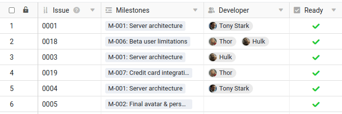
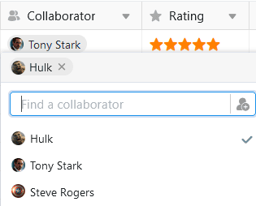
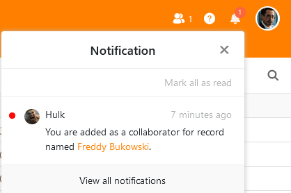
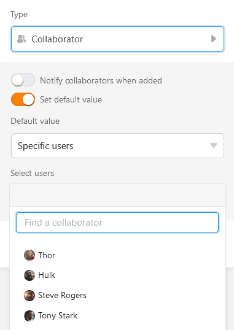

В **столбце Сотрудники** вы можете назначить одного или нескольких **человек** в строке. SeaTable позволяет выбрать людей, которые в настоящее время имеют **доступ** к **базе**, а также всех остальных членов команды, не имеющих доступа.

## Выберите лиц, имеющих доступ к базе

Если **дважды щелкнуть** в ячейке столбца сотрудников, появится список со всеми пользователями, которые в настоящее время имеют доступ к базе. Выберите одного или нескольких из **них**. Вы также можете использовать **поле поиска**, чтобы найти конкретного пользователя.



## Выберите членов команды, не имеющих доступа к базе

Если вы не можете найти пользователя через поле поиска в столбце "Сотрудник", значит, в данный момент у него **нет доступа** к базе. Однако если он является **членом вашей команды**, вы все равно можете ввести его в колонку "Сотрудник".

Нажмите на значок , чтобы добавить членов команды без доступа. Введите имя пользователя в **поле поиска**, выберите нужного **члена команды** и подтвердите **добавление**.

## Уведомление сотрудника при добавлении

При создании столбца сотрудников можно **активизировать ползунок**, чтобы сотрудники получали [уведомление](), когда другие заносят их в столбец и таким образом назначают их в строку.

Сотрудники получают соответствующее уведомление в Base, доступ к которому можно получить через **символ колокольчика**  в правом верхнем углу.

## Установите значение по умолчанию

Вы можете установить одного или нескольких сотрудников в качестве [значения по умолчанию]() в столбце сотрудников. Для выбора доступны варианты **Текущий пользователь** или **Конкретные пользователи**. Когда кто-то добавляет новую строку в таблицу, в столбец сотрудников автоматически вводится либо создатель строки, либо выбранные лица.

## Выберите сотрудников в качестве получателей автоматических уведомлений

При отправке уведомлений с помощью [автоматики]() вы можете выбрать в качестве получателей сообщения всех лиц, указанных в столбце "Сотрудники".

## Колонка сотрудника в универсальных приложениях

Колонка сотрудников является преимуществом и в [универсальном приложении](). Вы можете активировать опцию, чтобы члены команды были видны всем пользователям, в выпадающем списке в [настройках]() приложения.

Если вы не хотите, чтобы пользователи приложения могли видеть записи данных других пользователей, задайте **предустановленные фильтры**: если страница отфильтрована по столбцу сотрудников с условием "включает текущего пользователя", каждый пользователь универсального приложения увидит только те записи, которые назначены ему в таблице.

