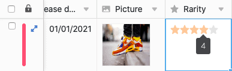

Die Rating-Spalte ermöglicht die **Einstufung** Ihrer Datensätze, um ein **Ranking** oder eine **Qualitätsbewertung** vorzunehmen. Beim Erstellen der Spalte können Sie spezifische Einstellungen vornehmen, die das Aussehen und die maximal zulässige Anzahl der **Rating-Symbole** betreffen.

## Anlegen der Rating-Spalte

1. Wählen Sie als Spaltentyp **Rating** aus und geben Sie der neuen Spalte einen **Namen**.
 
2. Legen Sie ein **Rating-Symbol** fest.
 
3. Bestimmen Sie die maximal zulässige **Punktzahl von 1 bis 10**.
 
4. Sie können einen **Standardwert** festlegen, der automatisch in jeder neuen Zeile erscheint. Wenn Sie den Regler nicht aktivieren, ist die voreingestellte Punktzahl 0.
 
5. Bestätigen Sie mit **Abschicken**.

## Bewertung vornehmen und verändern

Wenn Sie auf eine **Zelle** in einer Rating-Spalte **klicken**, wird Ihnen die maximal mögliche Anzahl von Symbolen in blassem Grau angezeigt. Um eine Bewertung auf der Rating-Skala vorzunehmen, klicken Sie einfach auf das Rating-Symbol, das die gewünschte Punktzahl markiert. Um eine bestehende Bewertung anzupassen, gehen Sie identisch vor. 

## Bewertung löschen

Um eine bereits vorgenommene Bewertung in einer Zeile wieder zu **löschen**, klicken Sie entweder auf den **aktuellen Wert** oder Sie markieren die Zelle und drücken die **Backspace-** oder **Entfernen-Taste** auf Ihrer Tastatur.
