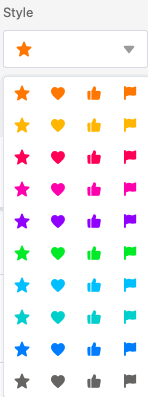

La columna de calificación le permite **calificar** sus registros para **ordenarlos** o darles una **puntuación**. Al crear la columna, puede realizar ajustes específicos relativos a la apariencia y al número máximo de **símbolos de calificación** permitidos.

## Crear la columna de calificación

1. Seleccione **Calificación** como tipo de columna y asigne un **nombre** a la nueva columna.

2. Establezca un **símbolo de calificación**.

3. Determine el **número máximo de puntos** permitidos **de 1 a 10**.

4. Puede establecer un **valor por defecto** que aparecerá automáticamente en cada nueva fila. Si no activa el control deslizante, la puntuación por defecto es 0.

5. Confirme con **Enviar**.

## Realizar y modificar la evaluación

Al **hacer clic** en una **celda** de una columna de calificación, el número máximo posible de símbolos aparece en gris pálido. Para hacer una evaluación en la escala de valoración, basta con hacer clic en el símbolo de calificación que marca la puntuación deseada. Para ajustar una calificación existente, proceda de forma idéntica.

## Borrar la calificación

Para **eliminar** una calificación ya realizada en una fila, haga clic en el **valor actual** o seleccione la celda y pulse la **tecla** **Retroceso** o **Supr** del teclado.
