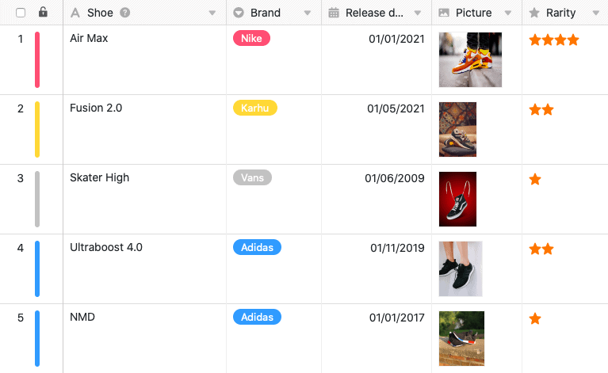
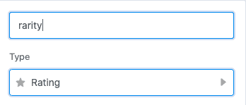
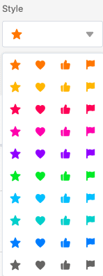
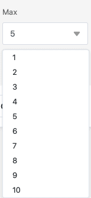
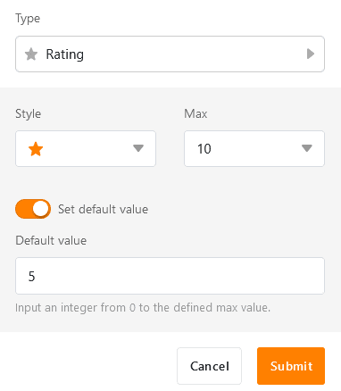
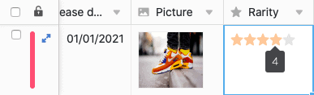

La colonne Classement permet de **classer** vos enregistrements afin d'établir un **ordre** ou une **évaluation de la qualité**. Lors de la création de la colonne, vous pouvez définir des paramètres spécifiques concernant l'apparence et le nombre maximal de **symboles de classement** autorisés.

## Création de la colonne de classement

1. Sélectionnez **Classement** comme type de colonne et donnez un **nom** à la nouvelle colonne.

2. Définissez une **icône de classement**.

1. Déterminez le **nombre de points maximum de 1 à 10**.

1. Vous pouvez définir une **valeur par défaut** qui apparaîtra automatiquement sur chaque nouvelle ligne. Si vous n'activez pas le curseur, le score par défaut est de 0.

1. Confirmez en cliquant sur **Envoyer**.

## Effectuer et modifier l'évaluation

Lorsque vous **cliquez** sur une **cellule** dans une colonne de classement, le nombre maximum de symboles possibles s'affiche en gris pâle. Pour effectuer une évaluation sur l'échelle de notation, il suffit de cliquer sur l'icône de classement qui met en évidence le nombre de points souhaité. Pour adapter une évaluation existante, procédez de manière identique.

## Supprimer l'évaluation

Pour **supprimer** une évaluation déjà effectuée sur une ligne, vous pouvez soit cliquer sur la **valeur actuelle**, soit sélectionner la cellule et appuyer sur la **touche Backspace** ou **Supprimer** de votre clavier.
