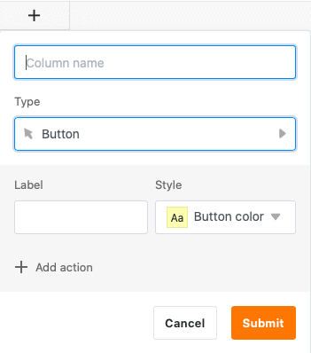
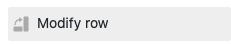
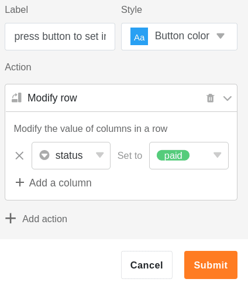
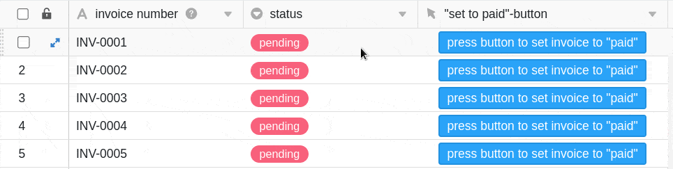

Die Schaltflächen-Spalte besitzt eine ähnliche Funktion wie [Automationen](), wobei Sie Schaltflächen immer **manuell** bedienen müssen. Mithilfe des **Buttons**, den Sie in dieser Spalte Ihren **Zeilen** hinzufügen können, lösen Sie im Vorhinein definierte **Aktionen** aus. Aus diesem Grund eignet sich dieser Spaltentyp besonders gut für die Automatisierung von Prozessschritten.

## Anlegen der Schaltfläche

Als Erstes benennen Sie die **Spalte** und legen die **Beschriftung** und **Farbe des Buttons** fest, den Sie Ihren Zeilen hinzufügen möchten.

Im nächsten Schritt legen Sie eine beliebige Anzahl an **Aktionen** fest, die durch Aktivierung der Schaltfläche ausgelöst werden sollen. Dabei haben Sie die Möglichkeit, **mehrere** Aktionen hintereinanderzuschalten.

Sie können insgesamt zwischen **neun** verschiedenen Aktionen wählen:

- Zeile sperren
- Zeile bearbeiten
- Zeile in eine andere Tabelle kopieren
- URL öffnen
- Plugin öffnen (nur möglich, wenn Sie mindestens ein [Plugin]() aktiviert haben)
- PDF-Datei in Spalte speichern (nur möglich, wenn das [Seitendesign-Plugin]() aktiviert ist)
- Benachrichtigung versenden
- E-Mail versenden
- Skript ausführen

## Anwendungsbeispiel

In diesem Anwendungsbeispiel nutzen wir die Schaltfläche, um bezahlten Rechnungen per Mausklick den Status "paid" zuzuweisen. Hierfür nehmen wir die Aktion **Zeile bearbeiten**.

In den **Spalten-Einstellungen** legen wir fest, dass die Einträge in der Einfachauswahl-Spalte **"status"** durch Aktivierung der Schaltfläche von **"pending"** auf **"paid"** gesetzt werden.

Nach einem Klick auf die Schaltfläche ändert sich der **Status** der ausgewählten Rechnung auf **paid**.

### Zusätzliche Möglichkeit

Um die Automatisierung von Prozessschritten zu erweitern, können Sie Schaltflächen auch in Kombination mit [Automationen]().

